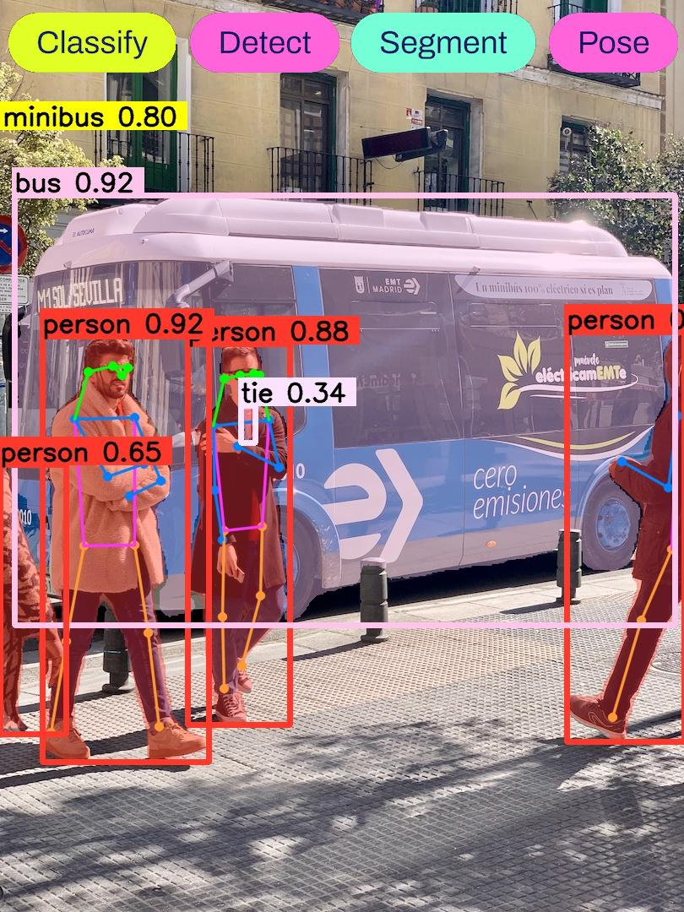

## 简介

该仓库基于 [shouxieai/tensorRT_Pro](https://github.com/shouxieai/tensorRT_Pro)，并进行了调整以支持 YOLOv8 的各项任务。

* 目前已支持 YOLOv8、YOLOv8-Cls、YOLOv8-Seg、YOLOv8-Pose 高性能推理🚀🚀🚀
* 基于 tensorRT8.x，C++ 高级接口，C++ 部署，服务器/嵌入式使用

<div align=center></div>

## CSDN文章同步讲解
- 🔥 [YOLOv8推理详解及部署实现](https://blog.csdn.net/qq_40672115/article/details/134276907)
- 🔥 [YOLOv8-Cls推理详解及部署实现](https://blog.csdn.net/qq_40672115/article/details/134277392)
- 🔥 [YOLOv8-Seg推理详解及部署实现](https://blog.csdn.net/qq_40672115/article/details/134277752)
- 🔥 [YOLOv8-Pose推理详解及部署实现](https://blog.csdn.net/qq_40672115/article/details/134278117)


## 环境配置

该项目依赖于 cuda、cudnn、tensorRT、opencv、protobuf 库，请在 CMakeLists.txt 或 Makefile 中手动指定路径配置

* 服务器
  * CUDA >= 10.2
  * cuDNN >= 8.x
  * TensorRT >= 8.x
  * protobuf == 3.11.4
  * 软件安装请参考：[Ubuntu20.04软件安装大全](https://blog.csdn.net/qq_40672115/article/details/130255299)
* 嵌入式
  * jetpack >= 4.6

克隆该项目

```shell
git clone https://github.com/Melody-Zhou/tensorRT_Pro-YOLOv8.git
```

<details>
<summary>CMakeLists.txt 编译</summary>

1. 修改库文件路径

```cmake
# CMakeLists.txt 13 行, 修改 opencv 路径
set(OpenCV_DIR   "/usr/local/include/opencv4/")

# CMakeLists.txt 15 行, 修改 cuda 路径
set(CUDA_TOOLKIT_ROOT_DIR     "/usr/local/cuda-11.6")

# CMakeLists.txt 16 行, 修改 cudnn 路径
set(CUDNN_DIR    "/usr/local/cudnn8.4.0.27-cuda11.6")

# CMakeLists.txt 17 行, 修改 tensorRT 路径
set(TENSORRT_DIR "/opt/TensorRT-8.4.1.5")

# CMakeLists.txt 20 行, 修改 protobuf 路径
set(PROTOBUF_DIR "/home/jarvis/protobuf")
```
2. 编译

```shell
mkdir build
cd build
cmake ..
make -j64
```

</details>

<details>
<summary>Makefile 编译</summary>

1. 修改库文件路径

```makefile
# Makefile 4 行，修改 protobuf 路径
lean_protobuf  := /home/jarvis/protobuf

# Makefile 5 行，修改 tensorRT 路径
lean_tensor_rt := /opt/TensorRT-8.4.1.5

# Makefile 6 行，修改 cudnn 路径
lean_cudnn     := /usr/local/cudnn8.4.0.27-cuda11.6

# Makefile 7 行，修改 opencv 路径
lean_opencv    := /usr/local

# Makefile 8 行，修改 cuda 路径
lean_cuda      := /usr/local/cuda-11.6
```

2. 编译

```shell
make -j64
```

</details>

## 各项任务支持

<details>
<summary>YOLOv8支持</summary>

1. 下载 YOLOv8

```shell
git clone https://github.com/ultralytics/ultralytics.git
```

2. 修改代码, 保证动态 batch

```python
# ========== head.py ==========

# ultralytics/nn/modules/head.py第72行，forward函数
# return y if self.export else (y, x)
# 修改为：

return y.permute(0, 2, 1) if self.export else (y, x)

# ========== exporter.py ==========

# ultralytics/engine/exporter.py第323行
# output_names = ['output0', 'output1'] if isinstance(self.model, SegmentationModel) else ['output0']
# dynamic = self.args.dynamic
# if dynamic:
#     dynamic = {'images': {0: 'batch', 2: 'height', 3: 'width'}}  # shape(1,3,640,640)
#     if isinstance(self.model, SegmentationModel):
#         dynamic['output0'] = {0: 'batch', 2: 'anchors'}  # shape(1, 116, 8400)
#         dynamic['output1'] = {0: 'batch', 2: 'mask_height', 3: 'mask_width'}  # shape(1,32,160,160)
#     elif isinstance(self.model, DetectionModel):
#         dynamic['output0'] = {0: 'batch', 2: 'anchors'}  # shape(1, 84, 8400)
# 修改为：

output_names = ['output0', 'output1'] if isinstance(self.model, SegmentationModel) else ['output']
dynamic = self.args.dynamic
if dynamic:
    dynamic = {'images': {0: 'batch'}}  # shape(1,3,640,640)
    if isinstance(self.model, SegmentationModel):
        dynamic['output0'] = {0: 'batch', 2: 'anchors'}  # shape(1, 116, 8400)
        dynamic['output1'] = {0: 'batch', 2: 'mask_height', 3: 'mask_width'}  # shape(1,32,160,160)
    elif isinstance(self.model, DetectionModel):
        dynamic['output'] = {0: 'batch'}  # shape(1, 84, 8400)
```

3. 导出 onnx 模型, 在 ultralytics-main 新建导出文件 `export.py` 内容如下：

```python
# ========== export.py ==========
from ultralytics import YOLO

model = YOLO("yolov8s.pt")

success = model.export(format="onnx", dynamic=True, simplify=True)
```

```shell
cd ultralytics-main
python export.py
```

4. 复制模型并执行

```shell
cp ultralyrics/yolov8s.onnx tensorRT_Pro-YOLOv8/workspace/
cd tensorRT_Pro-YOLOv8
make yolo -j64
```
</details>

<details>
<summary>YOLOv8-Cls支持</summary>

1. 下载 YOLOv8

```shell
git clone https://github.com/ultralytics/ultralytics.git
```

2. 修改代码, 保证动态 batch

```python
# ========== exporter.py ==========

# ultralytics/engine/exporter.py第323行
# output_names = ['output0', 'output1'] if isinstance(self.model, SegmentationModel) else ['output0']
# dynamic = self.args.dynamic
# if dynamic:
#     dynamic = {'images': {0: 'batch', 2: 'height', 3: 'width'}}  # shape(1,3,640,640)
#     if isinstance(self.model, SegmentationModel):
#         dynamic['output0'] = {0: 'batch', 2: 'anchors'}  # shape(1, 116, 8400)
#         dynamic['output1'] = {0: 'batch', 2: 'mask_height', 3: 'mask_width'}  # shape(1,32,160,160)
#     elif isinstance(self.model, DetectionModel):
#         dynamic['output0'] = {0: 'batch', 2: 'anchors'}  # shape(1, 84, 8400)
# 修改为：

output_names = ['output0', 'output1'] if isinstance(self.model, SegmentationModel) else ['output']
dynamic = self.args.dynamic
if dynamic:
    dynamic = {'images': {0: 'batch'}}  # shape(1,3,640,640)
    dynamic['output'] = {0: 'batch'}
    if isinstance(self.model, SegmentationModel):
        dynamic['output0'] = {0: 'batch', 2: 'anchors'}  # shape(1, 116, 8400)
        dynamic['output1'] = {0: 'batch', 2: 'mask_height', 3: 'mask_width'}  # shape(1,32,160,160)
    elif isinstance(self.model, DetectionModel):
        dynamic['output'] = {0: 'batch'}  # shape(1, 84, 8400)
```

3. 导出 onnx 模型, 在 ultralytics-main 新建导出文件 `export.py` 内容如下：

```python
# ========== export.py ==========
from ultralytics import YOLO

model = YOLO("yolov8s-cls.pt")

success = model.export(format="onnx", dynamic=True, simplify=True)
```

```shell
cd ultralytics-main
python export.py
```

4. 复制模型并执行

```shell
cp ultralyrics/yolov8s-cls.onnx tensorRT_Pro-YOLOv8/workspace/
cd tensorRT_Pro-YOLOv8
make yolo_cls -j64
```
</details>

<details>
<summary>YOLOv8-Seg支持</summary>

1. 下载 YOLOv8

```shell
git clone https://github.com/ultralytics/ultralytics.git
```

2. 修改代码, 保证动态 batch

```python
# ========== head.py ==========

# ultralytics/nn/modules/head.py第106行，forward函数
# return (torch.cat([x, mc], 1), p) if self.export else (torch.cat([x[0], mc], 1), (x[1], mc, p))
# 修改为：

return (torch.cat([x, mc], 1).permute(0, 2, 1), p) if self.export else (torch.cat([x[0], mc], 1), (x[1], mc, p))

# ========== exporter.py ==========

# ultralytics/engine/exporter.py第323行
# output_names = ['output0', 'output1'] if isinstance(self.model, SegmentationModel) else ['output0']
# dynamic = self.args.dynamic
# if dynamic:
#     dynamic = {'images': {0: 'batch', 2: 'height', 3: 'width'}}  # shape(1,3,640,640)
#     if isinstance(self.model, SegmentationModel):
#         dynamic['output0'] = {0: 'batch', 2: 'anchors'}  # shape(1, 116, 8400)
#         dynamic['output1'] = {0: 'batch', 2: 'mask_height', 3: 'mask_width'}  # shape(1,32,160,160)
#     elif isinstance(self.model, DetectionModel):
#         dynamic['output0'] = {0: 'batch', 2: 'anchors'}  # shape(1, 84, 8400)
# 修改为：

output_names = ['output0', 'output1'] if isinstance(self.model, SegmentationModel) else ['output0']
dynamic = self.args.dynamic
if dynamic:
    dynamic = {'images': {0: 'batch'}}  # shape(1,3,640,640)
    if isinstance(self.model, SegmentationModel):
        dynamic['output0'] = {0: 'batch'}  # shape(1, 116, 8400)
        dynamic['output1'] = {0: 'batch'}  # shape(1,32,160,160)
    elif isinstance(self.model, DetectionModel):
        dynamic['output0'] = {0: 'batch', 2: 'anchors'}  # shape(1, 84, 8400)
```

3. 导出 onnx 模型, 在 ultralytics-main 新建导出文件 `export.py` 内容如下：

```python
# ========== export.py ==========
from ultralytics import YOLO

model = YOLO("yolov8s-seg.pt")

success = model.export(format="onnx", dynamic=True, simplify=True)
```

```shell
cd ultralytics-main
python export.py
```

4. 复制模型并执行

```shell
cp ultralyrics/yolov8s-seg.onnx tensorRT_Pro-YOLOv8/workspace/
cd tensorRT_Pro-YOLOv8
make yolo_seg -j64
```
</details>

<details>
<summary>YOLOv8-Pose支持</summary>

1. 下载 YOLOv8

```shell
git clone https://github.com/ultralytics/ultralytics.git
```

2. 修改代码, 保证动态 batch

```python
# ========== head.py ==========

# ultralytics/nn/modules/head.py第130行，forward函数
# return torch.cat([x, pred_kpt], 1) if self.export else (torch.cat([x[0], pred_kpt], 1), (x[1], kpt))
# 修改为：

return torch.cat([x, pred_kpt], 1).permute(0, 2, 1) if self.export else (torch.cat([x[0], pred_kpt], 1), (x[1], kpt))

# ========== exporter.py ==========

# ultralytics/engine/exporter.py第323行
# output_names = ['output0', 'output1'] if isinstance(self.model, SegmentationModel) else ['output0']
# dynamic = self.args.dynamic
# if dynamic:
#     dynamic = {'images': {0: 'batch', 2: 'height', 3: 'width'}}  # shape(1,3,640,640)
#     if isinstance(self.model, SegmentationModel):
#         dynamic['output0'] = {0: 'batch', 2: 'anchors'}  # shape(1, 116, 8400)
#         dynamic['output1'] = {0: 'batch', 2: 'mask_height', 3: 'mask_width'}  # shape(1,32,160,160)
#     elif isinstance(self.model, DetectionModel):
#         dynamic['output0'] = {0: 'batch', 2: 'anchors'}  # shape(1, 84, 8400)
# 修改为：

output_names = ['output0', 'output1'] if isinstance(self.model, SegmentationModel) else ['output']
dynamic = self.args.dynamic
if dynamic:
    dynamic = {'images': {0: 'batch'}}  # shape(1,3,640,640)
    dynamic['output'] = {0: 'batch'}
    if isinstance(self.model, SegmentationModel):
        dynamic['output0'] = {0: 'batch', 2: 'anchors'}  # shape(1, 116, 8400)
        dynamic['output1'] = {0: 'batch', 2: 'mask_height', 3: 'mask_width'}  # shape(1,32,160,160)
    elif isinstance(self.model, DetectionModel):
        dynamic['output0'] = {0: 'batch', 2: 'anchors'}  # shape(1, 84, 8400)
```

3. 导出 onnx 模型, 在 ultralytics-main 新建导出文件 `export.py` 内容如下：

```python
# ========== export.py ==========
from ultralytics import YOLO

model = YOLO("yolov8s-pose.pt")

success = model.export(format="onnx", dynamic=True, simplify=True)
```

```shell
cd ultralytics-main
python export.py
```

4. 复制模型并执行

```shell
cp ultralyrics/yolov8s-pose.onnx tensorRT_Pro-YOLOv8/workspace/
cd tensorRT_Pro-YOLOv8
make yolo_pose -j64
```
</details>

## 接口介绍

<details>
<summary>编译接口</summary>

```cpp
TRT::compile(
    mode,                       // FP32、FP16、INT8
    test_batch_size,            // max batch size
    onnx_file,                  // source 
    model_file,                 // save to
    {},                         // redefine the input shape
    int8process,                // the recall function for calibration
    "inference",                // the dir where the image data is used for calibration
    ""                          // the dir where the data generated from calibration is saved(a.k.a where to load the calibration data.)
);
```
* tensorRT_Pro 原编译接口, 支持 FP32、FP16、INT8 编译
* 模型的编译工作也可以通过 `trtexec` 工具完成
</details>

<details>
<summary>推理接口</summary>

```cpp
// 创建推理引擎在 0 号显卡上
auto engine = YoloPose::create_infer(
    engine_file,                    // engine file
    deviceid,                       // gpu id
    0.25f,                          // confidence threshold
    0.45f,                          // nms threshold
    YoloPose::NMSMethod::FastGPU,   // NMS method, fast GPU / CPU
    1024,                           // max objects
    false                           // preprocess use multi stream
);

// 加载图像
auto image = cv::imread("inference/car.jpg");

// 推理并获取结果
auto boxes = engine->commit(image).get()  // 得到的是 vector<Box>
```

</details>

## 参考
- [https://github.com/shouxieai/tensorRT_Pro](https://github.com/shouxieai/tensorRT_Pro)
- [https://github.com/shouxieai/infer](https://github.com/shouxieai/infer)