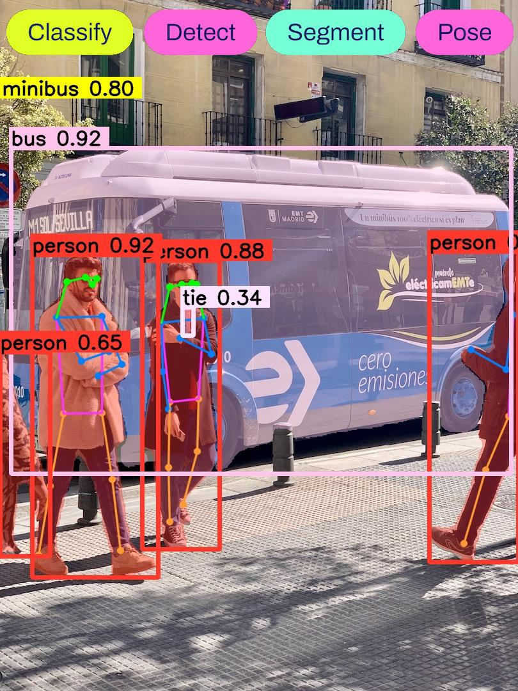

## 简介

该仓库基于 [shouxieai/tensorRT_Pro](https://github.com/shouxieai/tensorRT_Pro)，并进行了调整以支持 YOLOv8 的各项任务。

* 目前已支持 YOLOv8、YOLOv8-Cls、YOLOv8-Seg、YOLOv8-OBB、YOLOv8-Pose、RT-DETR、ByteTrack、YOLOv9、YOLOv10、RTMO、PP-OCRv4、LaneATT、CLRNet、CLRerNet、YOLO11、Depth-Anything、YOLOv12、YOLOv13、YOLO26 高性能推理！！！🚀🚀🚀
* 基于 tensorRT8.x，C++ 高级接口，C++ 部署，服务器/嵌入式使用

<div align=center></div>

## CSDN文章同步讲解
- 🔥 [YOLOv8推理详解及部署实现](https://blog.csdn.net/qq_40672115/article/details/134276907)
- 🔥 [YOLOv8-Cls推理详解及部署实现](https://blog.csdn.net/qq_40672115/article/details/134277392)
- 🔥 [YOLOv8-Seg推理详解及部署实现](https://blog.csdn.net/qq_40672115/article/details/134277752)
- 🔥 [YOLOv8-OBB推理详解及部署实现](https://blog.csdn.net/qq_40672115/article/details/135713830)
- 🔥 [YOLOv8-Pose推理详解及部署实现](https://blog.csdn.net/qq_40672115/article/details/134278117)
- 🔥 [RT-DETR推理详解及部署实现](https://blog.csdn.net/qq_40672115/article/details/134356250)
- 🔥 [YOLOv9推理详解及部署实现](https://blog.csdn.net/qq_40672115/article/details/136492338)
- 🔥 [YOLOv10推理详解及部署实现](https://blog.csdn.net/qq_40672115/article/details/139216405)
- 🔥 [MMPose-RTMO推理详解及部署实现（上）](https://blog.csdn.net/qq_40672115/article/details/139364023)
- 🔥 [MMPose-RTMO推理详解及部署实现（下）](https://blog.csdn.net/qq_40672115/article/details/139375752)
- 🔥 [LayerNorm Plugin的使用与说明](https://blog.csdn.net/qq_40672115/article/details/140246052)
- 🔥 [PaddleOCR-PP-OCRv4推理详解及部署实现（上）](https://blog.csdn.net/qq_40672115/article/details/140571346)
- 🔥 [PaddleOCR-PP-OCRv4推理详解及部署实现（中）](https://blog.csdn.net/qq_40672115/article/details/140585830)
- 🔥 [PaddleOCR-PP-OCRv4推理详解及部署实现（下）](https://blog.csdn.net/qq_40672115/article/details/140648937)
- 🔥 [LaneATT推理详解及部署实现（上）](https://blog.csdn.net/qq_40672115/article/details/140891544)
- 🔥 [LaneATT推理详解及部署实现（下）](https://blog.csdn.net/qq_40672115/article/details/140909528)
- 🔥 [CLRNet推理详解及部署实现（上）](https://blog.csdn.net/qq_40672115/article/details/141090952)
- 🔥 [CLRNet推理详解及部署实现（下）](https://blog.csdn.net/qq_40672115/article/details/141107365)
- 🔥 [CLRerNet推理详解及部署实现（上）](https://blog.csdn.net/qq_40672115/article/details/141275384)
- 🔥 [CLRerNet推理详解及部署实现（下）](https://blog.csdn.net/qq_40672115/article/details/141275949)
- 🔥 [YOLO11推理详解及部署实现](https://blog.csdn.net/qq_40672115/article/details/143089165)
- 🔥 [Depth-Anything推理详解及部署实现（上）](https://blog.csdn.net/qq_40672115/article/details/144199266)
- 🔥 [Depth-Anything推理详解及部署实现（下）](https://blog.csdn.net/qq_40672115/article/details/144475226)
- 🔥 [YOLOv12推理详解及部署实现](https://blog.csdn.net/qq_40672115/article/details/145738637)

## Top News
- **2026/1/15**
  - YOLO26 分类、检测、分割、姿态点估计任务支持
- **2025/6/25**
  - YOLOv13 支持
- **2025/2/19**
  - YOLOv12 支持
- **2024/12/14**
  - Depth-Anything 支持
- **2024/10/20**
  - YOLO11 分类、检测、分割、姿态点估计任务支持
- **2024/8/18**
  - CLRerNet 支持
- **2024/8/11**
  - CLRNet 支持
- **2024/8/4**
  - LaneATT 支持
  - 提供测试视频下载（[Baidu Drive](https://pan.baidu.com/s/1g-DvhZSIbXhEqp4iiFANTQ?pwd=lane )）
- **2024/7/24**
  - PP-OCRv4 支持
  - cuOSD 支持，代码 copy 自 [Lidar_AI_Solution/libraries/cuOSD](https://github.com/NVIDIA-AI-IOT/Lidar_AI_Solution/tree/master/libraries/cuOSD)
- **2024/7/7**
  - LayerNorm Plugin 支持，代码 copy 自 [CUDA-BEVFusion/src/plugins/custom_layernorm.cu](https://github.com/NVIDIA-AI-IOT/Lidar_AI_Solution/blob/master/CUDA-BEVFusion/src/plugins/custom_layernorm.cu)
  - 提供 ONNX 模型下载（[Baidu Drive](https://pan.baidu.com/s/1MbPYzUEkONsjCPOudiTt1A?pwd=onnx)），方便大家测试使用
- **2024/6/1**
  - RTMO 支持
- **2024/5/29**
  - 修改 YOLOv6 的 ONNX 导出以及推理
- **2024/5/26**
  - YOLOv10 支持
- **2024/3/5**
  - YOLOv9 支持
- **2024/2/1**
  - 新增 MinMaxCalibrator 校准器，可以通过 `TRT::Calibrator::MinMax` 指定
  - 新增 mAP 测试使用的一些脚本文件，mAP 计算代码 copy 自 [yolov6/core/evaler.py#L231](https://github.com/meituan/YOLOv6/blob/main/yolov6/core/evaler.py#L231)
- **2024/1/21**
  - YOLOv8-OBB 支持
  - ByteTrack 支持，实现基本跟踪功能
- **2024/1/10**
  - 修复 IoU 计算 bug
- **2023/11/12**
  - RT-DETR 支持
- **2023/11/07**
  - 首次提交代码，YOLOv8 分类、检测、分割、姿态点估计任务支持

## 环境配置

该项目依赖于 cuda、cudnn、tensorRT、opencv、protobuf 库，请在 CMakeLists.txt 或 Makefile 中手动指定路径配置

* 服务器
  * CUDA >= 10.2
  * cuDNN >= 8.x
  * TensorRT >= 8.x
  * protobuf == 3.11.4
  * 软件安装请参考：[Ubuntu20.04软件安装大全](https://blog.csdn.net/qq_40672115/article/details/130255299)
* 嵌入式
  * jetpack >= 4.6
  * protobuf == 3.11.4

克隆该项目

```shell
git clone https://github.com/Melody-Zhou/tensorRT_Pro-YOLOv8.git
```

<details>
<summary>CMakeLists.txt 编译</summary>

1. 修改库文件路径

```cmake
# CMakeLists.txt 13 行, 修改 opencv 路径
set(OpenCV_DIR   "/usr/local/include/opencv4/")

# CMakeLists.txt 15 行, 修改 cuda 路径
set(CUDA_TOOLKIT_ROOT_DIR     "/usr/local/cuda-11.6")

# CMakeLists.txt 16 行, 修改 cudnn 路径
set(CUDNN_DIR    "/usr/local/cudnn8.4.0.27-cuda11.6")

# CMakeLists.txt 17 行, 修改 tensorRT 路径
set(TENSORRT_DIR "/opt/TensorRT-8.4.1.5")

# CMakeLists.txt 20 行, 修改 protobuf 路径
set(PROTOBUF_DIR "/home/jarvis/protobuf")
```
2. 编译

```shell
mkdir build
cd build
cmake ..
make -j64
```

</details>

<details>
<summary>Makefile 编译</summary>

1. 修改库文件路径

```makefile
# Makefile 4 行，修改 protobuf 路径
lean_protobuf  := /home/jarvis/protobuf

# Makefile 5 行，修改 tensorRT 路径
lean_tensor_rt := /opt/TensorRT-8.4.1.5

# Makefile 6 行，修改 cudnn 路径
lean_cudnn     := /usr/local/cudnn8.4.0.27-cuda11.6

# Makefile 7 行，修改 opencv 路径
lean_opencv    := /usr/local

# Makefile 8 行，修改 cuda 路径
lean_cuda      := /usr/local/cuda-11.6
```

2. 编译

```shell
make -j64
```

</details>

## 各项任务支持

<details>
<summary>YOLOv3支持</summary>

1. 下载 YOLOv3

```shell
git clone https://github.com/ultralytics/yolov3.git
```

2. 修改代码, 保证动态 batch

```python
# ========== export.py ==========

# yolov3/export.py第160行
# output_names = ['output0', 'output1'] if isinstance(model, SegmentationModel) else ['output0']
# if dynamic:
#     dynamic = {'images': {0: 'batch', 2: 'height', 3: 'width'}}  # shape(1,3,640,640)
#     if isinstance(model, SegmentationModel):
#         dynamic['output0'] = {0: 'batch', 1: 'anchors'}  # shape(1,25200,85)
#         dynamic['output1'] = {0: 'batch', 2: 'mask_height', 3: 'mask_width'}  # shape(1,32,160,160)
#         elif isinstance(model, DetectionModel):
#             dynamic['output0'] = {0: 'batch', 1: 'anchors'}  # shape(1,25200,85)
# 修改为：

output_names = ['output0', 'output1'] if isinstance(model, SegmentationModel) else ['output']            
if dynamic:
    dynamic = {'images': {0: 'batch'}}  # shape(1,3,640,640)
    if isinstance(model, SegmentationModel):
        dynamic['output0'] = {0: 'batch', 1: 'anchors'}  # shape(1,25200,85)
        dynamic['output1'] = {0: 'batch', 2: 'mask_height', 3: 'mask_width'}  # shape(1,32,160,160)
    elif isinstance(model, DetectionModel):
        dynamic['output'] = {0: 'batch'}  # shape(1,25200,85)
```

3. 导出 onnx 模型

```shell
cd yolov3
python export.py --weights=yolov3.pt --dynamic --simplify --include=onnx --opset=11
```

4. 复制模型并执行

```shell
cp yolov3/yolov3.onnx tensorRT_Pro-YOLOv8/workspace
cd tensorRT_Pro-YOLOv8

# 修改代码在 src/application/app_yolo.cpp: app_yolo 函数中, 使用 V3 的方式即可运行
# test(Yolo::Type::V3, TRT::Mode::FP32, "yolov3");

make yolo -j64
```

</details>

<details>
<summary>YOLOX支持</summary>

1. 下载 YOLOX

```shell
git clone https://github.com/Megvii-BaseDetection/YOLOX.git
```

2. 导出 onnx 模型

```shell
cd YOLOX
export PYTHONPATH=$PYTHONPATH:.
python tools/export_onnx.py -c yolox_s.pth -f exps/default/yolox_s.py --output-name=yolox_s.onnx --dynamic --decode_in_inference
```

3. 复制模型并执行

```shell
cp YOLOX/yolox_s.onnx tensorRT_Pro-YOLOv8/workspace
cd tensorRT_Pro-YOLOv8

# 修改代码在 src/application/app_yolo.cpp: app_yolo 函数中, 使用 X 的方式即可运行
# test(Yolo::Type::X, TRT::Mode::FP32, "yolox_s");

make yolo -j64
```

</details>

<details>
<summary>YOLOv5支持</summary>

1. 下载 YOLOv5

```shell
git clone https://github.com/ultralytics/yolov5.git
```

2. 修改代码, 保证动态 batch

```python
# ========== export.py ==========

# yolov5/export.py第160行
# output_names = ['output0', 'output1'] if isinstance(model, SegmentationModel) else ['output0']
# if dynamic:
#     dynamic = {'images': {0: 'batch', 2: 'height', 3: 'width'}}  # shape(1,3,640,640)
#     if isinstance(model, SegmentationModel):
#         dynamic['output0'] = {0: 'batch', 1: 'anchors'}  # shape(1,25200,85)
#         dynamic['output1'] = {0: 'batch', 2: 'mask_height', 3: 'mask_width'}  # shape(1,32,160,160)
#         elif isinstance(model, DetectionModel):
#             dynamic['output0'] = {0: 'batch', 1: 'anchors'}  # shape(1,25200,85)
# 修改为：

output_names = ['output0', 'output1'] if isinstance(model, SegmentationModel) else ['output']            
if dynamic:
    dynamic = {'images': {0: 'batch'}}  # shape(1,3,640,640)
    if isinstance(model, SegmentationModel):
        dynamic['output0'] = {0: 'batch', 1: 'anchors'}  # shape(1,25200,85)
        dynamic['output1'] = {0: 'batch', 2: 'mask_height', 3: 'mask_width'}  # shape(1,32,160,160)
    elif isinstance(model, DetectionModel):
        dynamic['output'] = {0: 'batch'}  # shape(1,25200,85)
```

3. 导出 onnx 模型

```shell
cd yolov5
python export.py --weights=yolov5s.pt --dynamic --simplify --include=onnx --opset=11
```

4. 复制模型并执行

```shell
cp yolov5/yolov5s.onnx tensorRT_Pro-YOLOv8/workspace
cd tensorRT_Pro-YOLOv8

# 修改代码在 src/application/app_yolo.cpp: app_yolo 函数中, 使用 V5 的方式即可运行
# test(Yolo::Type::V5, TRT::Mode::FP32, "yolov5s");

make yolo -j64
```

</details>

<details>
<summary>YOLOv6支持</summary>

1. 下载 YOLOv6

```shell
git clone https://github.com/meituan/YOLOv6.git
```

2. 修改代码, 保证动态 batch，并去除 anchor 维度


```python
# ========== export_onnx.py ==========

# YOLOv6/deploy/ONNX/export_onnx.py第84行
# output_axes = {
#     'outputs': {0: 'batch'},
# }
# 修改为：

output_axes = {
    'output': {0: 'batch'},
}

# YOLOv6/deploy/ONNX/export_onnx.py第106行
# torch.onnx.export(model, img, f, verbose=False, opset_version=13,
#                     training=torch.onnx.TrainingMode.EVAL,
#                     do_constant_folding=True,
#                     input_names=['images'],
#                     output_names=['num_dets', 'det_boxes', 'det_scores', 'det_classes']
#                     if args.end2end else ['outputs'],
#                     dynamic_axes=dynamic_axes)
# 修改为：

torch.onnx.export(model, img, f, verbose=False, opset_version=13,
                    training=torch.onnx.TrainingMode.EVAL,
                    do_constant_folding=True,
                    input_names=['images'],
                    output_names=['num_dets', 'det_boxes', 'det_scores', 'det_classes']
                    if args.end2end else ['output'],
                    dynamic_axes=dynamic_axes)

# 根据不同的 head 去除 anchor 维度
# ========== effidehead_distill_ns.py ==========
# YOLOv6/yolov6/models/heads/effidehead_distill_ns.py第141行
# return torch.cat(
#     [
#         pred_bboxes,
#         torch.ones((b, pred_bboxes.shape[1], 1), device=pred_bboxes.device, dtype=pred_bboxes.dtype),
#         cls_score_list
#     ],
#     axis=-1)
# 修改为：
return torch.cat(
    [
        pred_bboxes,
        cls_score_list
    ],
    axis=-1)

# ========== effidehead_fuseab.py ==========
# YOLOv6/yolov6/models/heads/effidehead_fuseab.py第191行
# return torch.cat(
#     [
#         pred_bboxes,
#         torch.ones((b, pred_bboxes.shape[1], 1), device=pred_bboxes.device, dtype=pred_bboxes.dtype),
#         cls_score_list
#     ],
#     axis=-1)
# 修改为：
return torch.cat(
    [
        pred_bboxes,
        cls_score_list
    ],
    axis=-1)

# ========== effidehead_lite.py ==========
# YOLOv6/yolov6/models/heads/effidehead_lite.py第123行
# return torch.cat(
#     [
#         pred_bboxes,
#         torch.ones((b, pred_bboxes.shape[1], 1), device=pred_bboxes.device, dtype=pred_bboxes.dtype),
#         cls_score_list
#     ],
#     axis=-1)
# 修改为：
return torch.cat(
    [
        pred_bboxes,
        cls_score_list
    ],
    axis=-1)
```

3. 导出 onnx 模型

```shell
cd YOLOv6
python deploy/ONNX/export_onnx.py --weights yolov6s.pt --img 640 --dynamic-batch --simplify
```

4. 复制模型并执行

```shell
cp YOLOv6/yolov6s.onnx tensorRT_Pro-YOLOv8/workspace
cd tensorRT_Pro-YOLOv8

# 修改代码在 src/application/app_yolo.cpp: app_yolo 函数中, 使用 V6 的方式即可运行
# test(Yolo::Type::V6, TRT::Mode::FP32, "yolov6s");

make yolo -j64
```
</details>

<details>
<summary>YOLOv7支持</summary>

1. 下载 YOLOv7

```shell
git clone https://github.com/WongKinYiu/yolov7.git 
```

2. 导出 onnx 模型


```shell
python export.py --dynamic-batch --grid --simplify --weights=yolov7.pt
```

3. 复制模型并执行

```shell
cp yolov7/yolov7.onnx tensorRT_Pro-YOLOv8/workspace
cd tensorRT_Pro-YOLOv8

# 修改代码在 src/application/app_yolo.cpp: app_yolo 函数中, 使用 V7 的方式即可运行
# test(Yolo::Type::V7, TRT::Mode::FP32, "yolov7");

make yolo -j64
```

</details>

<details>
<summary>YOLOv8支持</summary>

1. 下载 YOLOv8

```shell
git clone https://github.com/ultralytics/ultralytics.git
```

2. 修改代码, 保证动态 batch

```python
# ========== head.py ==========

# ultralytics/nn/modules/head.py第72行，forward函数
# return y if self.export else (y, x)
# 修改为：

return y.permute(0, 2, 1) if self.export else (y, x)

# ========== exporter.py ==========

# ultralytics/engine/exporter.py第323行
# output_names = ['output0', 'output1'] if isinstance(self.model, SegmentationModel) else ['output0']
# dynamic = self.args.dynamic
# if dynamic:
#     dynamic = {'images': {0: 'batch', 2: 'height', 3: 'width'}}  # shape(1,3,640,640)
#     if isinstance(self.model, SegmentationModel):
#         dynamic['output0'] = {0: 'batch', 2: 'anchors'}  # shape(1, 116, 8400)
#         dynamic['output1'] = {0: 'batch', 2: 'mask_height', 3: 'mask_width'}  # shape(1,32,160,160)
#     elif isinstance(self.model, DetectionModel):
#         dynamic['output0'] = {0: 'batch', 2: 'anchors'}  # shape(1, 84, 8400)
# 修改为：

output_names = ['output0', 'output1'] if isinstance(self.model, SegmentationModel) else ['output']
dynamic = self.args.dynamic
if dynamic:
    dynamic = {'images': {0: 'batch'}}  # shape(1,3,640,640)
    if isinstance(self.model, SegmentationModel):
        dynamic['output0'] = {0: 'batch', 2: 'anchors'}  # shape(1, 116, 8400)
        dynamic['output1'] = {0: 'batch', 2: 'mask_height', 3: 'mask_width'}  # shape(1,32,160,160)
    elif isinstance(self.model, DetectionModel):
        dynamic['output'] = {0: 'batch'}  # shape(1, 84, 8400)
```

3. 导出 onnx 模型, 在 ultralytics-main 新建导出文件 `export.py` 内容如下：

```python
# ========== export.py ==========
from ultralytics import YOLO

model = YOLO("yolov8s.pt")

success = model.export(format="onnx", dynamic=True, simplify=True)
```

```shell
cd ultralytics-main
python export.py
```

4. 复制模型并执行

```shell
cp ultralytics/yolov8s.onnx tensorRT_Pro-YOLOv8/workspace
cd tensorRT_Pro-YOLOv8
make yolo -j64
```
</details>

<details>
<summary>YOLOv8-Cls支持</summary>

1. 下载 YOLOv8

```shell
git clone https://github.com/ultralytics/ultralytics.git
```

2. 修改代码, 保证动态 batch

```python
# ========== exporter.py ==========

# ultralytics/engine/exporter.py第323行
# output_names = ['output0', 'output1'] if isinstance(self.model, SegmentationModel) else ['output0']
# dynamic = self.args.dynamic
# if dynamic:
#     dynamic = {'images': {0: 'batch', 2: 'height', 3: 'width'}}  # shape(1,3,640,640)
#     if isinstance(self.model, SegmentationModel):
#         dynamic['output0'] = {0: 'batch', 2: 'anchors'}  # shape(1, 116, 8400)
#         dynamic['output1'] = {0: 'batch', 2: 'mask_height', 3: 'mask_width'}  # shape(1,32,160,160)
#     elif isinstance(self.model, DetectionModel):
#         dynamic['output0'] = {0: 'batch', 2: 'anchors'}  # shape(1, 84, 8400)
# 修改为：

output_names = ['output0', 'output1'] if isinstance(self.model, SegmentationModel) else ['output']
dynamic = self.args.dynamic
if dynamic:
    dynamic = {'images': {0: 'batch'}}  # shape(1,3,640,640)
    dynamic['output'] = {0: 'batch'}
    if isinstance(self.model, SegmentationModel):
        dynamic['output0'] = {0: 'batch', 2: 'anchors'}  # shape(1, 116, 8400)
        dynamic['output1'] = {0: 'batch', 2: 'mask_height', 3: 'mask_width'}  # shape(1,32,160,160)
    elif isinstance(self.model, DetectionModel):
        dynamic['output'] = {0: 'batch'}  # shape(1, 84, 8400)
```

3. 导出 onnx 模型, 在 ultralytics-main 新建导出文件 `export.py` 内容如下：

```python
# ========== export.py ==========
from ultralytics import YOLO

model = YOLO("yolov8s-cls.pt")

success = model.export(format="onnx", dynamic=True, simplify=True)
```

```shell
cd ultralytics-main
python export.py
```

4. 复制模型并执行

```shell
cp ultralytics/yolov8s-cls.onnx tensorRT_Pro-YOLOv8/workspace
cd tensorRT_Pro-YOLOv8
make yolo_cls -j64
```
</details>

<details>
<summary>YOLOv8-Seg支持</summary>

1. 下载 YOLOv8

```shell
git clone https://github.com/ultralytics/ultralytics.git
```

2. 修改代码, 保证动态 batch

```python
# ========== head.py ==========

# ultralytics/nn/modules/head.py第106行，forward函数
# return (torch.cat([x, mc], 1), p) if self.export else (torch.cat([x[0], mc], 1), (x[1], mc, p))
# 修改为：

return (torch.cat([x, mc], 1).permute(0, 2, 1), p) if self.export else (torch.cat([x[0], mc], 1), (x[1], mc, p))

# ========== exporter.py ==========

# ultralytics/engine/exporter.py第323行
# output_names = ['output0', 'output1'] if isinstance(self.model, SegmentationModel) else ['output0']
# dynamic = self.args.dynamic
# if dynamic:
#     dynamic = {'images': {0: 'batch', 2: 'height', 3: 'width'}}  # shape(1,3,640,640)
#     if isinstance(self.model, SegmentationModel):
#         dynamic['output0'] = {0: 'batch', 2: 'anchors'}  # shape(1, 116, 8400)
#         dynamic['output1'] = {0: 'batch', 2: 'mask_height', 3: 'mask_width'}  # shape(1,32,160,160)
#     elif isinstance(self.model, DetectionModel):
#         dynamic['output0'] = {0: 'batch', 2: 'anchors'}  # shape(1, 84, 8400)
# 修改为：

output_names = ['output0', 'output1'] if isinstance(self.model, SegmentationModel) else ['output0']
dynamic = self.args.dynamic
if dynamic:
    dynamic = {'images': {0: 'batch'}}  # shape(1,3,640,640)
    if isinstance(self.model, SegmentationModel):
        dynamic['output0'] = {0: 'batch'}  # shape(1, 116, 8400)
        dynamic['output1'] = {0: 'batch'}  # shape(1,32,160,160)
    elif isinstance(self.model, DetectionModel):
        dynamic['output0'] = {0: 'batch', 2: 'anchors'}  # shape(1, 84, 8400)
```

3. 导出 onnx 模型, 在 ultralytics-main 新建导出文件 `export.py` 内容如下：

```python
# ========== export.py ==========
from ultralytics import YOLO

model = YOLO("yolov8s-seg.pt")

success = model.export(format="onnx", dynamic=True, simplify=True)
```

```shell
cd ultralytics-main
python export.py
```

4. 复制模型并执行

```shell
cp ultralytics/yolov8s-seg.onnx tensorRT_Pro-YOLOv8/workspace
cd tensorRT_Pro-YOLOv8
make yolo_seg -j64
```
</details>

<details>
<summary>YOLOv8-OBB支持</summary>

1. 下载 YOLOv8

```shell
glit clone https://github.com/ultralytics/ultralytics.git
cd ultralytics
git checkout tags/v8.1.0 -b v8.1.0
```

2. 修改代码, 保证动态 batch

```python
# ========== head.py ==========

# ultralytics/nn/modules/head.py第141行，forward函数
# return torch.cat([x, angle], 1) if self.export else (torch.cat([x[0], angle], 1), (x[1], angle))
# 修改为：

return torch.cat([x, angle], 1).permute(0, 2, 1) if self.export else (torch.cat([x[0], angle], 1), (x[1], angle))

# ========== exporter.py ==========

# ultralytics/engine/exporter.py第353行
# output_names = ['output0', 'output1'] if isinstance(self.model, SegmentationModel) else ['output0']
# dynamic = self.args.dynamic
# if dynamic:
#     dynamic = {'images': {0: 'batch', 2: 'height', 3: 'width'}}  # shape(1,3,640,640)
#     if isinstance(self.model, SegmentationModel):
#         dynamic['output0'] = {0: 'batch', 2: 'anchors'}  # shape(1, 116, 8400)
#         dynamic['output1'] = {0: 'batch', 2: 'mask_height', 3: 'mask_width'}  # shape(1,32,160,160)
#     elif isinstance(self.model, DetectionModel):
#         dynamic['output0'] = {0: 'batch', 2: 'anchors'}  # shape(1, 84, 8400)
# 修改为：

output_names = ['output0', 'output1'] if isinstance(self.model, SegmentationModel) else ['output']
dynamic = self.args.dynamic
if dynamic:
    dynamic = {'images': {0: 'batch'}}  # shape(1,3,640,640)
    if isinstance(self.model, SegmentationModel):
        dynamic['output0'] = {0: 'batch', 2: 'anchors'}  # shape(1, 116, 8400)
        dynamic['output1'] = {0: 'batch', 2: 'mask_height', 3: 'mask_width'}  # shape(1,32,160,160)
    elif isinstance(self.model, DetectionModel):
        dynamic['output'] = {0: 'batch'}  # shape(1, 84, 8400)
```

3. 导出 onnx 模型, 在 ultralytics-main 新建导出文件 `export.py` 内容如下：

```python
# ========== export.py ==========
from ultralytics import YOLO

model = YOLO("yolov8s-obb.pt")

success = model.export(format="onnx", dynamic=True, simplify=True)
```

```shell
cd ultralytics-main
python export.py
```

4. 复制模型并执行

```shell
cp ultralytics/yolov8s-obb.onnx tensorRT_Pro-YOLOv8/workspace
cd tensorRT_Pro-YOLOv8
make yolo_obb -j64
```

</details>

<details>
<summary>YOLOv8-Pose支持</summary>

1. 下载 YOLOv8

```shell
git clone https://github.com/ultralytics/ultralytics.git
```

2. 修改代码, 保证动态 batch

```python
# ========== head.py ==========

# ultralytics/nn/modules/head.py第130行，forward函数
# return torch.cat([x, pred_kpt], 1) if self.export else (torch.cat([x[0], pred_kpt], 1), (x[1], kpt))
# 修改为：

return torch.cat([x, pred_kpt], 1).permute(0, 2, 1) if self.export else (torch.cat([x[0], pred_kpt], 1), (x[1], kpt))

# ========== exporter.py ==========

# ultralytics/engine/exporter.py第323行
# output_names = ['output0', 'output1'] if isinstance(self.model, SegmentationModel) else ['output0']
# dynamic = self.args.dynamic
# if dynamic:
#     dynamic = {'images': {0: 'batch', 2: 'height', 3: 'width'}}  # shape(1,3,640,640)
#     if isinstance(self.model, SegmentationModel):
#         dynamic['output0'] = {0: 'batch', 2: 'anchors'}  # shape(1, 116, 8400)
#         dynamic['output1'] = {0: 'batch', 2: 'mask_height', 3: 'mask_width'}  # shape(1,32,160,160)
#     elif isinstance(self.model, DetectionModel):
#         dynamic['output0'] = {0: 'batch', 2: 'anchors'}  # shape(1, 84, 8400)
# 修改为：

output_names = ['output0', 'output1'] if isinstance(self.model, SegmentationModel) else ['output']
dynamic = self.args.dynamic
if dynamic:
    dynamic = {'images': {0: 'batch'}}  # shape(1,3,640,640)
    dynamic['output'] = {0: 'batch'}
    if isinstance(self.model, SegmentationModel):
        dynamic['output0'] = {0: 'batch', 2: 'anchors'}  # shape(1, 116, 8400)
        dynamic['output1'] = {0: 'batch', 2: 'mask_height', 3: 'mask_width'}  # shape(1,32,160,160)
    elif isinstance(self.model, DetectionModel):
        dynamic['output0'] = {0: 'batch', 2: 'anchors'}  # shape(1, 84, 8400)
```

3. 导出 onnx 模型, 在 ultralytics-main 新建导出文件 `export.py` 内容如下：

```python
# ========== export.py ==========
from ultralytics import YOLO

model = YOLO("yolov8s-pose.pt")

success = model.export(format="onnx", dynamic=True, simplify=True)
```

```shell
cd ultralytics-main
python export.py
```

4. 复制模型并执行

```shell
cp ultralytics/yolov8s-pose.onnx tensorRT_Pro-YOLOv8/workspace
cd tensorRT_Pro-YOLOv8
make yolo_pose -j64
```
</details>

<details>
<summary>RT-DETR支持</summary>

1. 前置条件

- **tensorRT >= 8.6**

2. 下载 YOLOv8

```shell
git clone https://github.com/ultralytics/ultralytics.git
```

3. 修改代码, 保证动态 batch

```python
# ========== exporter.py ==========

# ultralytics/engine/exporter.py第323行
# output_names = ['output0', 'output1'] if isinstance(self.model, SegmentationModel) else ['output0']
# dynamic = self.args.dynamic
# if dynamic:
#     dynamic = {'images': {0: 'batch', 2: 'height', 3: 'width'}}  # shape(1,3,640,640)
#     if isinstance(self.model, SegmentationModel):
#         dynamic['output0'] = {0: 'batch', 2: 'anchors'}  # shape(1, 116, 8400)
#         dynamic['output1'] = {0: 'batch', 2: 'mask_height', 3: 'mask_width'}  # shape(1,32,160,160)
#     elif isinstance(self.model, DetectionModel):
#         dynamic['output0'] = {0: 'batch', 2: 'anchors'}  # shape(1, 84, 8400)
# 修改为：

output_names = ['output0', 'output1'] if isinstance(self.model, SegmentationModel) else ['output']
dynamic = self.args.dynamic
if dynamic:
    dynamic = {'images': {0: 'batch'}}  # shape(1,3,640,640)
    if isinstance(self.model, SegmentationModel):
        dynamic['output0'] = {0: 'batch', 2: 'anchors'}  # shape(1, 116, 8400)
        dynamic['output1'] = {0: 'batch', 2: 'mask_height', 3: 'mask_width'}  # shape(1,32,160,160)
    elif isinstance(self.model, DetectionModel):
        dynamic['output'] = {0: 'batch'}  # shape(1, 84, 8400)
```

4. 导出 onnx 模型，在 ultralytics-main 新建导出文件 `export.py` 内容如下（可能会由于 torch 版本问题导出失败, 具体可参考 [#6144](https://github.com/ultralytics/ultralytics/issues/6144)）

```python
from ultralytics import RTDETR

model = RTDETR("rtdetr-l.pt")

success = model.export(format="onnx", dynamic=True, simplify=True)
```

```shell
cd ultralytics-main
python export.py
```

5. engine 生成

- **方案一**：替换 tensorRT_Pro-YOLOv8 中的 onnxparser 解析器，具体可参考文章：[RT-DETR推理详解及部署实现](https://blog.csdn.net/qq_40672115/article/details/134356250)
- **方案二**：利用 **trtexec** 工具生成 engine

```shell
cp ultralytics/yolov8s.onnx tensorRT_Pro-YOLOv8/workspace
cd tensorRT_Pro-YOLOv8/workspace
bash build.sh
```

6. 执行

```shell
make rtdetr -j64
```

</details>


<details>
<summary>ByteTrack支持</summary>

1. 说明

代码 copy 自：[https://github.com/CYYAI/AiInfer/tree/main/utils/tracker/ByteTracker](https://github.com/CYYAI/AiInfer/tree/main/utils/tracker/ByteTracker)

以 YOLOv8 作为检测器实现基本跟踪功能（其它检测器也行）

2. demo 演示

```shell
cd tensorRT_Pro-YOLOv8
make bytetrack -j64
```

</details>

<details>
<summary>YOLOv9支持</summary>

1. 说明
   
本项目的 YOLOv9 部署实现并不是官方原版，而是采用的集成到 ultralytics 的 YOLOv9

2. 下载 YOLOv8

```shell
git clone https://github.com/ultralytics/ultralytics.git
```

3. 修改代码, 保证动态 batch

```python
# ========== head.py ==========

# ultralytics/nn/modules/head.py第75行，forward函数
# return y if self.export else (y, x)
# 修改为：

return y.permute(0, 2, 1) if self.export else (y, x)

# ========== exporter.py ==========

# ultralytics/engine/exporter.py第365行
# output_names = ['output0', 'output1'] if isinstance(self.model, SegmentationModel) else ['output0']
# dynamic = self.args.dynamic
# if dynamic:
#     dynamic = {'images': {0: 'batch', 2: 'height', 3: 'width'}}  # shape(1,3,640,640)
#     if isinstance(self.model, SegmentationModel):
#         dynamic['output0'] = {0: 'batch', 2: 'anchors'}  # shape(1, 116, 8400)
#         dynamic['output1'] = {0: 'batch', 2: 'mask_height', 3: 'mask_width'}  # shape(1,32,160,160)
#     elif isinstance(self.model, DetectionModel):
#         dynamic['output0'] = {0: 'batch', 2: 'anchors'}  # shape(1, 84, 8400)
# 修改为：

output_names = ['output0', 'output1'] if isinstance(self.model, SegmentationModel) else ['output']
dynamic = self.args.dynamic
if dynamic:
    dynamic = {'images': {0: 'batch'}}  # shape(1,3,640,640)
    if isinstance(self.model, SegmentationModel):
        dynamic['output0'] = {0: 'batch', 2: 'anchors'}  # shape(1, 116, 8400)
        dynamic['output1'] = {0: 'batch', 2: 'mask_height', 3: 'mask_width'}  # shape(1,32,160,160)
    elif isinstance(self.model, DetectionModel):
        dynamic['output'] = {0: 'batch'}  # shape(1, 84, 8400)
```

4. 导出 onnx 模型, 在 ultralytics-main 新建导出文件 `export.py` 内容如下：

```python
# ========== export.py ==========
from ultralytics import YOLO

model = YOLO("yolov9c.pt")

success = model.export(format="onnx", dynamic=True, simplify=True)
```

```shell
cd ultralytics-main
python export.py
```

5. 复制模型并执行

```shell
cp ultralytics/yolov9c.onnx tensorRT_Pro-YOLOv8/workspace
cd tensorRT_Pro-YOLOv8
make yolo -j64
```
</details>

<details>

<summary>YOLOv10支持</summary>

1. 前置条件

- **tensorRT >= 8.5**

2. 下载 YOLOv10

```shell
git clone https://github.com/THU-MIG/yolov10
```

3. 修改代码, 保证动态 batch

```python
# ========== exporter.py ==========

# yolov10-main/ultralytics/engine/exporter.py第323行
# output_names = ['output0', 'output1'] if isinstance(self.model, SegmentationModel) else ['output0']
# dynamic = self.args.dynamic
# if dynamic:
#     dynamic = {'images': {0: 'batch', 2: 'height', 3: 'width'}}  # shape(1,3,640,640)
#     if isinstance(self.model, SegmentationModel):
#         dynamic['output0'] = {0: 'batch', 2: 'anchors'}  # shape(1, 116, 8400)
#         dynamic['output1'] = {0: 'batch', 2: 'mask_height', 3: 'mask_width'}  # shape(1,32,160,160)
#     elif isinstance(self.model, DetectionModel):
#         dynamic['output0'] = {0: 'batch', 2: 'anchors'}  # shape(1, 84, 8400)
# 修改为：

output_names = ['output0', 'output1'] if isinstance(self.model, SegmentationModel) else ['output']
dynamic = self.args.dynamic
if dynamic:
    dynamic = {'images': {0: 'batch'}}  # shape(1,3,640,640)
    if isinstance(self.model, SegmentationModel):
        dynamic['output0'] = {0: 'batch', 2: 'anchors'}  # shape(1, 116, 8400)
        dynamic['output1'] = {0: 'batch', 2: 'mask_height', 3: 'mask_width'}  # shape(1,32,160,160)
    elif isinstance(self.model, DetectionModel):
        dynamic['output'] = {0: 'batch'}  # shape(1, 84, 8400)
```

4. 导出 onnx 模型，在 yolov10-main 新建导出文件 `export.py` 内容如下

```python
from ultralytics import YOLO

model = YOLO("yolov10s.pt")

success = model.export(format="onnx", dynamic=True, simplify=True, opset=13)
```

```shell
cd yolov10-main
python export.py
```

5. engine 生成

- **方案一**：替换 tensorRT_Pro-YOLOv8 中的 onnxparser 解析器，具体可参考文章：[RT-DETR推理详解及部署实现](https://blog.csdn.net/qq_40672115/article/details/134356250)
- **方案二**：利用 **trtexec** 工具生成 engine

```shell
cp yolov10-main/yolov10s.onnx tensorRT_Pro-YOLOv8/workspace
cd tensorRT_Pro-YOLOv8/workspace
# 取消 build.sh 中 yolov10 engine 生成的注释
bash build.sh
```

6. 执行

```shell
make yolo -j64
```

</details>

<details>

<summary>RTMO支持</summary>

1. 前置条件

- **tensorRT >= 8.6**

2. RTMO 导出环境搭建

```shell
conda create -n mmpose python=3.9
conda activate mmpose
pip install torch==2.0.1 torchvision==0.15.2 torchaudio==2.0.2 --index-url https://download.pytorch.org/whl/cu118
pip install -U openmim
mim install mmengine
mim install "mmcv>=2.0.0rc2"
mim install "mmpose>=1.1.0"
pip install mmdeploy==1.3.1
pip install mmdeploy-runtime==1.3.1
```

3. 项目克隆

```shell
git clone https://github.com/open-mmlab/mmpose.git
```   

4. 预训练权重下载

- 参考：[https://github.com/open-mmlab/mmpose/tree/main/projects/rtmo-model-zoo](https://github.com/open-mmlab/mmpose/tree/main/projects/rtmo#%EF%B8%8F-model-zoo)

5. 导出 onnx 模型，在 mmpose-main 新建导出文件 `export.py` 内容如下：

```python
import torch
from mmpose.apis import init_model
from mmpose.structures.bbox import bbox_xyxy2cs

class MyModel(torch.nn.Module):
    def __init__(self) -> None:
        super().__init__()
        self.model = init_model(config_file, checkpoint_file, device=device)
        test_cfg = {'input_size': (640, 640)}
        self.model.neck.switch_to_deploy(test_cfg)
        self.model.head.switch_to_deploy(test_cfg)
        self.model.head.dcc.switch_to_deploy(test_cfg)

    def forward(self, x):
        x = self.model.backbone(x)
        x = self.model.neck(x)
        cls_scores, bbox_preds, _, kpt_vis, pose_vecs = self.model.head(x)[:5]
        scores = self.model.head._flatten_predictions(cls_scores).sigmoid()
        flatten_bbox_preds = self.model.head._flatten_predictions(bbox_preds)
        flatten_pose_vecs  = self.model.head._flatten_predictions(pose_vecs)
        flatten_kpt_vis    = self.model.head._flatten_predictions(kpt_vis).sigmoid()
        bboxes = self.model.head.decode_bbox(flatten_bbox_preds, self.model.head.flatten_priors,
                                             self.model.head.flatten_stride)
        dets      = torch.cat([bboxes, scores], dim=2)
        grids     = self.model.head.flatten_priors
        bbox_cs   = torch.cat(bbox_xyxy2cs(dets[..., :4], self.model.head.bbox_padding), dim=-1)
        keypoints = self.model.head.dcc.forward_test(flatten_pose_vecs, bbox_cs, grids)
        pred_kpts = torch.cat([keypoints, flatten_kpt_vis.unsqueeze(-1)], dim=-1)
        bs, bboxes, ny, nx = map(int, pred_kpts.shape)
        bs = -1
        pred_kpts = pred_kpts.view(bs, bboxes, ny*nx)
        return torch.cat([dets, pred_kpts], dim=2)

if __name__ == "__main__":

    device = "cpu"
    config_file     = "configs/body_2d_keypoint/rtmo/body7/rtmo-s_8xb32-600e_body7-640x640.py"
    checkpoint_file = "rtmo-s_8xb32-600e_body7-640x640-dac2bf74_20231211.pth"

    model = MyModel()
    model.eval()

    x = torch.zeros(1, 3, 640, 640, device=device)
    dynamic_batch = {'images': {0: 'batch'}, 'output': {0: 'batch'}}
    torch.onnx.export(
        model,
        (x,),
        "rtmo-s_8xb32-600e_body7-640x640.onnx",
        input_names=["images"],
        output_names=["output"],
        opset_version=17,
        dynamic_axes=dynamic_batch
    )

    # Checks
    import onnx
    model_onnx = onnx.load("rtmo-s_8xb32-600e_body7-640x640.onnx")
    # onnx.checker.check_model(model_onnx)    # check onnx model

    # Simplify
    try:
        import onnxsim

        print(f"simplifying with onnxsim {onnxsim.__version__}...")
        model_onnx, check = onnxsim.simplify(model_onnx)
        assert check, "Simplified ONNX model could not be validated"
    except Exception as e:
        print(f"simplifier failure: {e}")

    onnx.save(model_onnx, "rtmo-s_8xb32-600e_body7-640x640.onnx")
    print(f"simplify done.")
```

```shell
cd mmpose-main
conda activate mmpose
python export.py
```

6. engien 生成

- **方案一**：替换 tensorRT_Pro-YOLOv8 中的 onnxparser 解析器，具体可参考文章：[RT-DETR推理详解及部署实现](https://blog.csdn.net/qq_40672115/article/details/134356250)
- **方案二**：利用 **trtexec** 工具生成 engine

```shell
cp mmpose/rtmo-s_8xb32-600e_body7-640x640.onnx tensorRT_Pro-YOLOv8/workspace
cd tensorRT_Pro-YOLOv8/workspace
# 取消 build.sh 中 rtmo engine 生成的注释
bash build.sh
```

7. 执行

```shell
make rtmo -j64
```

</details>

<details>

<summary>LayerNorm Plugin支持</summary>

1. 说明

* 当需要在低版本的 tensorRT 中解析 LayerNorm 算子时可以通过该插件支持
* LayerNorm 插件实现代码 copy 自 [CUDA-BEVFusion/src/plugins/custom_layernorm.cu](https://github.com/NVIDIA-AI-IOT/Lidar_AI_Solution/blob/master/CUDA-BEVFusion/src/plugins/custom_layernorm.cu)，代码进行了略微修改
* LayerNorm 插件的封装在推理时存在一些问题，因此并未使用

2. libcustom_layernorm.so 生成

```shell
cd tensorRT_Pro-YOLOv8
mkdir build && cd build
cmake .. && make -j64
cp libcustom_layernorm.so ../workspace
```

3. ONNX 模型修改（RTMO 为例说明，其它模型类似）

利用 onnx_graphsurgeon 修改原始 LayerNorm 的 op_type，代码如下：

```python
import onnx
import onnx_graphsurgeon as gs

# 加载 ONNX 模型
input_model_path = "rtmo-s_8xb32-600e_body7-640x640.onnx"
output_model_path = "rtmo-s_8xb32-600e_body7-640x640.plugin.onnx"
graph = gs.import_onnx(onnx.load(input_model_path))

# 遍历图中的所有节点
for node in graph.nodes:
    if node.op == "LayerNormalization":
        node.op = "CustomLayerNormalization"
        # 添加自定义属性
        node.attrs["name"] = "LayerNormPlugin"
        node.attrs["info"] = "This is custom LayerNormalization node"

# 删除无用的节点和张量
graph.cleanup()

# 导出修改后的模型
onnx.save(gs.export_onnx(graph), output_model_path)
```

4. engine 生成

利用 **trtexec** 工具加载插件解析 ONNX，新建 build.sh 脚本文件并执行，内容如下：

```shell
#! /usr/bin/bash

TRTEXEC=/home/jarvis/lean/TensorRT-8.5.1.7/bin/trtexec

# export LD_LIBRARY_PATH=$LD_LIBRARY_PATH:/home/jarvis/lean/TensorRT-8.5.1.7/lib

${TRTEXEC} \
  --onnx=rtmo-s_8xb32-600e_body7-640x640.plugin.onnx \
  --plugins=libcustom_layernorm.so \
  --minShapes=images:1x3x640x640 \
  --optShapes=images:1x3x640x640 \
  --maxShapes=images:4x3x640x640 \
  --memPoolSize=workspace:2048 \
  --saveEngine=rtmo-s_8xb32-600e_body7-640x640.plugin.FP32.trtmodel \
  > trtexec_output.log 2>&1
```

</details>

<details>
<summary>PP-OCRv4支持</summary>

1. 导出环境搭建

```shell
conda create --name paddleocr python=3.9
conda activate paddleocr
pip install shapely scikit-image imgaug pyclipper lmdb tqdm numpy==1.26.4 rapidfuzz onnxruntime
pip install "opencv-python<=4.6.0.66" "opencv-contrib-python<=4.6.0.66" cython "Pillow>=10.0.0" pyyaml requests
pip install paddlepaddle paddleocr paddle2onnx
```

2. 项目克隆

```shell
git clone https://github.com/PaddlePaddle/PaddleOCR.git
```

3. 预训练权重下载

- 参考：[🛠️ PP-OCR 系列模型列表（更新中）](https://github.com/PaddlePaddle/PaddleOCR?tab=readme-ov-file#%EF%B8%8F-pp-ocr-%E7%B3%BB%E5%88%97%E6%A8%A1%E5%9E%8B%E5%88%97%E8%A1%A8%E6%9B%B4%E6%96%B0%E4%B8%AD)

4. 导出 onnx 模型，具体流程请参考：[PaddleOCR-PP-OCRv4推理详解及部署实现（上）](https://blog.csdn.net/qq_40672115/article/details/140571346)

5. engine 生成
   
- **方案一**：利用 **TRT::compile** 接口，HardSwish 算子解析问题可以通过插件或者替换 onnxparser 解析器解决
- **方案二**：利用 **trtexec** 工具生成 engine (**recommend**)

```shell
cd tensorRT_Pro-YOLOv8/workspace
bash ocr_build.sh
```

6. 执行

```shell
make ppocr -j64
```

</details>

<details>
<summary>LaneATT支持</summary>

1. 导出环境搭建

```shell
conda create -n laneatt python=3.10
conda activate laneatt
pip install torch==2.0.1 torchvision==0.15.2 torchaudio==2.0.2
pip install pyyaml opencv-python scipy imgaug numpy==1.26.4 tqdm p_tqdm ujson scikit-learn tensorboard
pip install onnx onnxruntime onnx-simplifier
```

2. 项目克隆

```shell
git clone https://github.com/lucastabelini/LaneATT.git
```

3. 预训练权重下载

```shell
gdown "https://drive.google.com/uc?id=1R638ou1AMncTCRvrkQY6I-11CPwZy23T" # main experiments on TuSimple, CULane and LLAMAS (1.3 GB)
unzip laneatt_experiments.zip
```

4. 导出 onnx 模型，在 laneatt-main 新建导出文件 `export.py` 内容如下：

```python
import torch
from lib.models.laneatt import LaneATT

class LaneATTONNX(torch.nn.Module):
    def __init__(self, model):
        super(LaneATTONNX, self).__init__()
        # Params
        self.fmap_h = model.fmap_h  # 11
        self.fmap_w = model.fmap_w  # 20
        self.anchor_feat_channels = model.anchor_feat_channels  # 64
        self.anchors = model.anchors
        self.cut_xs = model.cut_xs
        self.cut_ys = model.cut_ys
        self.cut_zs = model.cut_zs
        self.invalid_mask = model.invalid_mask
        # Layers
        self.feature_extractor = model.feature_extractor
        self.conv1 = model.conv1
        self.cls_layer = model.cls_layer
        self.reg_layer = model.reg_layer
        self.attention_layer = model.attention_layer

        # Exporting the operator eye to ONNX opset version 11 is not supported
        attention_matrix = torch.eye(1000)
        self.non_diag_inds = torch.nonzero(attention_matrix == 0., as_tuple=False)
        self.non_diag_inds = self.non_diag_inds[:, 1] + 1000 * self.non_diag_inds[:, 0]  # 999000

        self.anchor_parts_1 = self.anchors[:, 2:4]
        self.anchor_parts_2 = self.anchors[:, 4:]

    def forward(self, x):
        batch_features = self.feature_extractor(x)
        batch_features = self.conv1(batch_features)
        # batch_anchor_features = self.cut_anchor_features(batch_features)
        # batchx15360
        batch_anchor_features = batch_features.reshape(-1, int(batch_features.numel()))
        # h, w = batch_features.shape[2:4]  # 12, 20
        indices = self.cut_xs + 20 * self.cut_ys + 12 * 20 * self.cut_zs        
        batch_anchor_features = batch_anchor_features[:, indices].\
            view(-1, 1000, self.anchor_feat_channels, self.fmap_h, 1)        
        # batch_anchor_features[self.invalid_mask] = 0
        batch_anchor_features = batch_anchor_features * torch.logical_not(self.invalid_mask)

        # Join proposals from all images into a single proposals features batch
        # batchx1000x704
        batch_anchor_features = batch_anchor_features.view(-1, 1000, self.anchor_feat_channels * self.fmap_h)

        # Add attention features
        softmax = torch.nn.Softmax(dim=2)
        # batchx1000x999
        scores = self.attention_layer(batch_anchor_features)
        attention = softmax(scores)
        # bs, _, _ = scores.shape
        bs, _, _ =scores.shape
        attention_matrix = torch.zeros(bs, 1000 * 1000, device=x.device)
        attention_matrix[:, self.non_diag_inds] = attention.reshape(-1, int(attention.numel()))
        attention_matrix = attention_matrix.view(-1, 1000, 1000)
        attention_features = torch.matmul(torch.transpose(batch_anchor_features, 1, 2),
                                          torch.transpose(attention_matrix, 1, 2)).transpose(1, 2)
        batch_anchor_features = torch.cat((attention_features, batch_anchor_features), dim=2)

        # Predict
        cls_logits = self.cls_layer(batch_anchor_features)
        reg = self.reg_layer(batch_anchor_features)

        anchor_expanded_1 = self.anchor_parts_1.repeat(reg.shape[0], 1, 1)
        anchor_expanded_2 = self.anchor_parts_2.repeat(reg.shape[0], 1, 1)  

        # Add offsets to anchors (1000, 2+2+73)
        reg_proposals = torch.cat([softmax(cls_logits), anchor_expanded_1, anchor_expanded_2 + reg], dim=2)

        return reg_proposals

def export_onnx(onnx_file_path):
    # e.g. laneatt_r18_culane
    backbone_name = 'resnet18'
    checkpoint_file_path = 'experiments/laneatt_r18_culane/models/model_0015.pt'
    anchors_freq_path = 'data/culane_anchors_freq.pt'

    # Load specified checkpoint
    model = LaneATT(backbone=backbone_name, anchors_freq_path=anchors_freq_path, topk_anchors=1000)
    checkpoint = torch.load(checkpoint_file_path)
    model.load_state_dict(checkpoint['model'])
    model.eval()

    # Export to ONNX
    onnx_model = LaneATTONNX(model)
    
    dummy_input = torch.randn(1, 3, 360, 640)
    dynamic_batch = {'images': {0: 'batch'}, 'output': {0: 'batch'}}
    torch.onnx.export(
        onnx_model, 
        dummy_input, 
        onnx_file_path, 
        input_names=["images"], 
        output_names=["output"],
        dynamic_axes=dynamic_batch
    )

    import onnx
    model_onnx = onnx.load(onnx_file_path)

    # Simplify
    try:
        import onnxsim

        print(f"simplifying with onnxsim {onnxsim.__version__}...")
        model_onnx, check = onnxsim.simplify(model_onnx)
        assert check, "Simplified ONNX model could not be validated"
    except Exception as e:
        print(f"simplifier failure: {e}")

    onnx.save(model_onnx, "laneatt.sim.onnx")
    print(f"simplify done. onnx model save in laneatt.sim.onnx")   

if __name__ == '__main__':
    export_onnx('./laneatt.onnx')
```

```shell
cd laneatt-main
conda activate laneatt
python export.py
```

5. engine 生成

- **方案一**：利用 **TRT::compile** 接口，ScatterND 算子解析问题可以通过插件或者替换 onnxparser 解析器解决
- **方案二**：利用 **trtexec** 工具生成 engine（**recommend**）

```shell
cd tensorRT_Pro-YOLOv8/workspace
bash lane_build.sh
```

</details>

<details>
<summary>CLRNet支持</summary>

**1.** 前置条件

- **tensorRT >= 8.6**

**2.** 导出环境搭建

```shell
conda create -n clrnet python=3.9
conda activate clrnet
pip install torch==2.0.1 torchvision==0.15.2 torchaudio==2.0.2
pip install pandas addict scikit-learn opencv-python pytorch_warmup scikit-image tqdm p_tqdm
pip install imgaug yapf timm pathspec pthflops
pip install numpy==1.26.4 mmcv==1.2.5 albumentations==0.4.6 ujson==1.35 Shapely==2.0.5
pip install onnx onnx-simplifier onnxruntime
```

**3.** 项目克隆

```shell
git clone https://github.com/Turoad/CLRNet.git
```

**4.** 预训练权重下载

- 下载链接（[Baidu Drive](https://pan.baidu.com/s/1rqXG6VXvzNeI-4Jl_vwKJQ?pwd=lane)）

**5.** 导出 onnx 模型，在 clrnet-main 新建导出文件 `export.py` 内容如下：

```python
import math
import torch
import torch.nn.functional as F
from clrnet.utils.config import Config
from mmcv.parallel import MMDataParallel
from clrnet.models.registry import build_net

class CLRNetONNX(torch.nn.Module):
    def __init__(self, model):
        super(CLRNetONNX, self).__init__()
        self.backbone = model.backbone
        self.neck     = model.neck
        self.head     = model.heads

    def forward(self, x):
        x = self.backbone(x)
        x = self.neck(x)
        batch_features = list(x[len(x) - self.head.refine_layers:])
        # 1x64x10x25+1x64x20x50+1x64x40x100
        batch_features.reverse()
        batch_size = batch_features[-1].shape[0]

        # 1x192x78
        priors = self.head.priors.repeat(batch_size, 1, 1)
        # 1x192x36
        priors_on_featmap = self.head.priors_on_featmap.repeat(batch_size, 1, 1)
        
        prediction_lists = []
        prior_features_stages = []
        for stage in range(self.head.refine_layers):
            # 1. anchor ROI pooling
            num_priors = int(priors_on_featmap.shape[1])
            prior_xs = torch.flip(priors_on_featmap, dims=[2])
            batch_prior_features = self.head.pool_prior_features(
                batch_features[stage], num_priors, prior_xs)
            prior_features_stages.append(batch_prior_features)

            # 2. ROI gather
            fc_features = self.head.roi_gather(prior_features_stages, 
                                               batch_features[stage], stage)
            
            # 3. cls and reg head           
            # fc_features = fc_features.view(num_priors, batch_size, -1).reshape(batch_size * num_priors, self.head.fc_hidden_dim)
            fc_features = fc_features.view(num_priors, -1, 64).reshape(-1, self.head.fc_hidden_dim)
            
            cls_features = fc_features.clone()
            reg_features = fc_features.clone()
            for cls_layer in self.head.cls_modules:
                cls_features = cls_layer(cls_features)
            for reg_layer in self.head.reg_modules:
                reg_features = reg_layer(reg_features)
            
            cls_logits = self.head.cls_layers(cls_features)
            reg = self.head.reg_layers(reg_features)

            # cls_logits = cls_logits.reshape(batch_size, -1, cls_logits.shape[1]) # (B, num_priors, 2)
            cls_logits = cls_logits.reshape(-1, 192, 2) # (B, num_priors, 2)
            # add softmax
            softmax = torch.nn.Softmax(dim=2)
            cls_logits = softmax(cls_logits)
            # reg = reg.reshape(batch_size, -1, reg.shape[1])
            reg = reg.reshape(-1, 192, 76)
            
            predictions = priors.clone()
            predictions[:, :, :2] = cls_logits
            predictions[:, :, 2:5] += reg[:, :, :3]
            # add n_strips * length
            # predictions[:, :, 5] = reg[:, :, 3] # length
            predictions[:, :, 5] = reg[:, :, 3] * self.head.n_strips # length
            
            def tran_tensor(t):
                return t.unsqueeze(2).clone().repeat(1, 1, self.head.n_offsets)
            
            batch_size = reg.shape[0]
            predictions[..., 6:] = (
                tran_tensor(predictions[..., 3]) * (self.head.img_w - 1) +
                ((1 - self.head.prior_ys.repeat(batch_size, num_priors, 1) -
                  tran_tensor(predictions[..., 2])) * self.head.img_h /
                 torch.tan(tran_tensor(predictions[..., 4]) * math.pi + 1e-5))) / (self.head.img_w - 1)

            prediction_lines = predictions.clone()
            predictions[..., 6:] += reg[..., 4:]

            prediction_lists.append(predictions)

            if stage != self.head.refine_layers - 1:
                priors = prediction_lines.detach().clone()
                priors_on_featmap = priors[..., 6 + self.head.sample_x_indexs]

        return prediction_lists[-1]            
    
def export_onnx(onnx_file_path):
    # e.g. clrnet_culane_r18
    cfg = Config.fromfile("configs/clrnet/clr_resnet18_culane.py")
    checkpoint_file_path = "culane_r18.pth"
    # load checkpoint
    net = build_net(cfg)
    net = MMDataParallel(net, device_ids=range(1)).cuda()
    pretrained_model = torch.load(checkpoint_file_path)
    net.load_state_dict(pretrained_model['net'], strict=False)
    net.eval()
    model = net.to("cpu")

    onnx_model = CLRNetONNX(model.module)
    # Export to ONNX
    dummy_input = torch.randn(1, 3 ,320, 800)
    dynamic_batch = {'images': {0: 'batch'}, 'output': {0: 'batch'}}
    torch.onnx.export(
        onnx_model,
        dummy_input,
        onnx_file_path,
        input_names=["images"],
        output_names=["output"],
        opset_version=17,
        dynamic_axes=dynamic_batch
    )
    print(f"finished export onnx model")

    import onnx
    model_onnx = onnx.load(onnx_file_path)
    onnx.checker.check_model(model_onnx)    # check onnx model

    # Simplify
    try:
        import onnxsim

        print(f"simplifying with onnxsim {onnxsim.__version__}...")
        model_onnx, check = onnxsim.simplify(model_onnx)
        assert check, "Simplified ONNX model could not be validated"
    except Exception as e:
        print(f"simplifier failure: {e}")

    onnx.save(model_onnx, "clrnet.sim.onnx")
    print(f"simplify done. onnx model save in clrnet.sim.onnx")
    
if __name__ == "__main__":
    export_onnx("./clrnet.onnx")
```

```shell
cd clrnet-main
conda activate clrnet
python export.py
```

**5.** engine 生成

- **方案一**：利用 **TRT::compile** 接口，GridSample 和 LayerNormalization 算子解析问题可以通过插件或者替换 onnxparser 解析器解决
- **方案二**：利用 **trtexec** 工具生成 engine（**recommend**）

```shell
cd tensorRT_Pro-YOLOv8/workspace
bash lane_build.sh
```

</details>

<details>
<summary>CLRerNet支持</summary>

**1.** 前置条件

- **tensorRT >= 8.6**

**2.** 导出环境搭建

```shell
conda create -n clrernet python=3.8
conda activate clrernet
pip install torch==2.0.1 torchvision==0.15.2 torchaudio==2.0.2
pip install -U openmim==0.3.3
mim install mmcv-full==1.7.0
pip install albumentations==0.4.6 p_tqdm==1.3.3 yapf==0.40.1 mmdet==2.28.0
pip install pytest pytest-cov tensorboard
pip install onnx onnx-simplifier onnxruntime
```

**3.** 项目克隆

```shell
git clone https://github.com/hirotomusiker/CLRerNet.git
```

**4.** 预训练权重下载

- 下载链接（[Baidu Drive](https://pan.baidu.com/s/1_rszDtajwTpvH1O_OPFR9A?pwd=lane)）

**5.** 导出 onnx 模型，在 clrernet-main 新建导出文件 `export.py` 内容如下：

```python
import torch
from mmcv import Config
from mmdet.models import build_detector
from mmcv.runner import load_checkpoint

class CLRerNetONNX(torch.nn.Module):
    def __init__(self, model):
        super(CLRerNetONNX, self).__init__()
        self.model = model
        self.bakcbone = model.backbone
        self.neck     = model.neck
        self.head     = model.bbox_head

    def forward(self, x):
        x = self.bakcbone(x)
        x = self.neck(x)
        
        batch = x[0].shape[0]
        feature_pyramid = list(x[len(x) - self.head.refine_layers:])
        # 1x64x10x25+1x64x20x50+1x64x40x100
        feature_pyramid.reverse()
        
        _, sampled_xs = self.head.anchor_generator.generate_anchors(
            self.head.anchor_generator.prior_embeddings.weight,
            self.head.prior_ys,
            self.head.sample_x_indices,
            self.head.img_w,
            self.head.img_h
        )

        anchor_params = self.head.anchor_generator.prior_embeddings.weight.clone().repeat(batch, 1, 1)
        priors_on_featmap = sampled_xs.repeat(batch, 1, 1)

        predictions_list = []
        pooled_features_stages = []
        for stage in range(self.head.refine_layers):
            # 1. anchor ROI pooling
            prior_xs = priors_on_featmap
            pooled_features = self.head.pool_prior_features(feature_pyramid[stage], prior_xs)
            pooled_features_stages.append(pooled_features)

            # 2. ROI gather
            fc_features = self.head.attention(pooled_features_stages, feature_pyramid, stage)
            # fc_features = fc_features.view(self.head.num_priors, batch, -1).reshape(batch * self.head.num_priors, self.head.fc_hidden_dim)
            fc_features = fc_features.view(self.head.num_priors, -1, 64).reshape(-1, self.head.fc_hidden_dim)

            # 3. cls and reg head
            cls_features = fc_features.clone()
            reg_features = fc_features.clone()
            for cls_layer in self.head.cls_modules:
                cls_features = cls_layer(cls_features)
            for reg_layer in self.head.reg_modules:
                reg_features = reg_layer(reg_features)
            
            cls_logits = self.head.cls_layers(cls_features)
            # cls_logits = cls_logits.reshape(batch, -1, cls_logits.shape[1])
            cls_logits = cls_logits.reshape(-1, 192, 2)

            reg = self.head.reg_layers(reg_features)
            # reg = reg.reshape(batch, -1, reg.shape[1])
            reg = reg.reshape(-1, 192, 76)

            # 4. reg processing
            anchor_params += reg[:, :, :3]
            updated_anchor_xs, _ = self.head.anchor_generator.generate_anchors(
                anchor_params.view(-1, 3),
                self.head.prior_ys,
                self.head.sample_x_indices,
                self.head.img_w,
                self.head.img_h
            )
            # updated_anchor_xs = updated_anchor_xs.view(batch, self.head.num_priors, -1)
            updated_anchor_xs = updated_anchor_xs.view(-1, 192, 72)
            reg_xs = updated_anchor_xs + reg[..., 4:]

            # start_y, start_x, theta
            # some problem.
            # anchor_params[:, :, 0] = 1.0 - anchor_params[:, :, 0]
            # anchor_params_ = anchor_params.clone()
            # anchor_params_[:, :, 0] = 1.0 - anchor_params_[:, :, 0]
            # print(f"anchor_params.shape = {anchor_params_.shape}")

            softmax = torch.nn.Softmax(dim=2)
            cls_logits = softmax(cls_logits)
            reg[:, :, 3:4] = reg[:, :, 3:4] * self.head.n_strips
            predictions = torch.concat([cls_logits, anchor_params, reg[:, :, 3:4], reg_xs], dim=2)
            # predictions = torch.concat([cls_logits, anchor_params_, reg[:, :, 3:4], reg_xs], dim=2)

            predictions_list.append(predictions)

            if stage != self.head.refine_layers - 1:
                anchor_params = anchor_params.detach().clone()
                priors_on_featmap = updated_anchor_xs.detach().clone()[
                    ..., self.head.sample_x_indices
                ]
        
        return predictions_list[-1]

    
if __name__ == "__main__":

    cfg = Config.fromfile("configs/clrernet/culane/clrernet_culane_dla34.py")
    model = build_detector(cfg.model, test_cfg=cfg.get("test_cfg"))
    load_checkpoint(model, "clrernet_culane_dla34.pth", map_location="cpu")
        
    model.eval()
    model = model.to("cpu")
    
    # Export to ONNX
    onnx_model = CLRerNetONNX(model)

    dummy_input = torch.randn(1, 3, 320, 800)

    dynamic_batch = {'images': {0: 'batch'}, 'output': {0: 'batch'}}
    torch.onnx.export(
        onnx_model, 
        dummy_input,
        "model.onnx",
        input_names=["images"],
        output_names=["output"],
        opset_version=17,
        dynamic_axes=dynamic_batch
    )
    print(f"finished export onnx model")

    import onnx
    model_onnx = onnx.load("model.onnx")
    onnx.checker.check_model(model_onnx)    # check onnx model

    # Simplify
    try:
        import onnxsim

        print(f"simplifying with onnxsim {onnxsim.__version__}...")
        model_onnx, check = onnxsim.simplify(model_onnx)
        assert check, "Simplified ONNX model could not be validated"
    except Exception as e:
        print(f"simplifier failure: {e}")

    onnx.save(model_onnx, "clrernet.sim.onnx")
    print(f"simplify done. onnx model save in clrernet.sim.onnx")
```

```shell
cd clrernet-main
conda activate clrernet
python export.py
```

**5.** engine 生成

- **方案一**：利用 **TRT::compile** 接口，GridSample 和 LayerNormalization 算子解析问题可以通过插件或者替换 onnxparser 解析器解决
- **方案二**：利用 **trtexec** 工具生成 engine（**recommend**）

```shell
cd tensorRT_Pro-YOLOv8/workspace
bash lane_build.sh
```

</details>

<details>
<summary>YOLO11支持</summary>

1. 下载 YOLO11

```shell
git clone https://github.com/ultralytics/ultralytics.git
```

2. 修改代码，保证动态 batch

```python
# ========== head.py ==========

# ultralytics/nn/modules/head.py第68行，forward函数
# return y if self.export else (y, x)
# 修改为：

return y.permute(0, 2, 1) if self.export else (y, x)

# ========== exporter.py ==========

# ultralytics/engine/exporter.py第400行
# output_names = ["output0", "output1"] if isinstance(self.model, SegmentationModel) else ["output0"]
# dynamic = self.args.dynamic
# if dynamic:
#     dynamic = {"images": {0: "batch", 2: "height", 3: "width"}}  # shape(1,3,640,640)
#     if isinstance(self.model, SegmentationModel):
#         dynamic["output0"] = {0: "batch", 2: "anchors"}  # shape(1, 116, 8400)
#         dynamic["output1"] = {0: "batch", 2: "mask_height", 3: "mask_width"}  # shape(1,32,160,160)
#     elif isinstance(self.model, DetectionModel):
#         dynamic["output0"] = {0: "batch", 2: "anchors"}  # shape(1, 84, 8400)
# 修改为：

output_names = ["output0", "output1"] if isinstance(self.model, SegmentationModel) else ["output"]
dynamic = self.args.dynamic
if dynamic:
    dynamic = {"images": {0: "batch"}}  # shape(1,3,640,640)
    if isinstance(self.model, SegmentationModel):
        dynamic["output0"] = {0: "batch", 2: "anchors"}  # shape(1, 116, 8400)
        dynamic["output1"] = {0: "batch", 2: "mask_height", 3: "mask_width"}  # shape(1,32,160,160)
    elif isinstance(self.model, DetectionModel):
        dynamic["output0"] = {0: "batch"}  # shape(1, 84, 8400)
```

3. 导出 onnx 模型，在 ultralytics-main 新建导出文件 `export.py` 内容如下：

```python
from ultralytics import YOLO

model = YOLO("yolo11s.pt")

success = model.export(format="onnx", dynamic=True, simplify=True)
```

```shell
cd ultralytics-main
python export.py
```

4. 复制模型并执行

```shell
cp ultralytics/yolo11s.onnx tensorRT_Pro-YOLOv8/workspace
cd tensorRT_Pro-YOLOv8
make yolo -j64
```

</details>

<details>
<summary>YOLO11-Cls支持</summary>

1. 下载 YOLO11

```shell
git clone https://github.com/ultralytics/ultralytics.git
```

2. 修改代码，保证动态 batch

```python
# ========== exporter.py ==========

# ultralytics/engine/exporter.py第400行
# output_names = ["output0", "output1"] if isinstance(self.model, SegmentationModel) else ["output0"]
# dynamic = self.args.dynamic
# if dynamic:
#     dynamic = {"images": {0: "batch", 2: "height", 3: "width"}}  # shape(1,3,640,640)
#     if isinstance(self.model, SegmentationModel):
#         dynamic["output0"] = {0: "batch", 2: "anchors"}  # shape(1, 116, 8400)
#         dynamic["output1"] = {0: "batch", 2: "mask_height", 3: "mask_width"}  # shape(1,32,160,160)
#     elif isinstance(self.model, DetectionModel):
#         dynamic["output0"] = {0: "batch", 2: "anchors"}  # shape(1, 84, 8400)
# 修改为：

output_names = ["output0", "output1"] if isinstance(self.model, SegmentationModel) else ["output"]
dynamic = self.args.dynamic
if dynamic:
    dynamic = {"images": {0: "batch"}}  # shape(1,3,640,640)
    if isinstance(self.model, SegmentationModel):
        dynamic["output0"] = {0: "batch", 2: "anchors"}  # shape(1, 116, 8400)
        dynamic["output1"] = {0: "batch", 2: "mask_height", 3: "mask_width"}  # shape(1,32,160,160)
    elif isinstance(self.model, DetectionModel):
        dynamic["output0"] = {0: "batch"}  # shape(1, 84, 8400)
```

3. 导出 onnx 模型，在 ultralytics-main 新建导出文件 `export.py` 内容如下：

```python
from ultralytics import YOLO

model = YOLO("yolo11s-cls.pt")

success = model.export(format="onnx", dynamic=True, simplify=True)
```

```shell
cd ultralytics-main
python export.py
```

4. 复制模型并执行

```shell
cp ultralytics/yolo11s-cls.onnx tensorRT_Pro-YOLOv8/workspace
cd tensorRT_Pro-YOLOv8
make yolo_cls -j64
```

</details>

<details>
<summary>YOLO11-Seg支持</summary>

1. 下载 YOLO11

```shell
git clone https://github.com/ultralytics/ultralytics.git
```

2. 修改代码，保证动态 batch

```python
# ========== head.py ==========

# ultralytics/nn/modules/head.py第186行，forward函数
# return (torch.cat([x, mc], 1), p) if self.export else (torch.cat([x[0], mc], 1), (x[1], mc, p))
# 修改为：

return (torch.cat([x, mc], 1).permute(0, 2, 1), p) if self.export else (torch.cat([x[0], mc], 1), (x[1], mc, p))

# ========== exporter.py ==========

# ultralytics/engine/exporter.py第400行
# output_names = ['output0', 'output1'] if isinstance(self.model, SegmentationModel) else ['output0']
# dynamic = self.args.dynamic
# if dynamic:
#     dynamic = {'images': {0: 'batch', 2: 'height', 3: 'width'}}  # shape(1,3,640,640)
#     if isinstance(self.model, SegmentationModel):
#         dynamic['output0'] = {0: 'batch', 2: 'anchors'}  # shape(1, 116, 8400)
#         dynamic['output1'] = {0: 'batch', 2: 'mask_height', 3: 'mask_width'}  # shape(1,32,160,160)
#     elif isinstance(self.model, DetectionModel):
#         dynamic['output0'] = {0: 'batch', 2: 'anchors'}  # shape(1, 84, 8400)
# 修改为：

output_names = ['output0', 'output1'] if isinstance(self.model, SegmentationModel) else ['output0']
dynamic = self.args.dynamic
if dynamic:
    dynamic = {'images': {0: 'batch'}}  # shape(1,3,640,640)
    if isinstance(self.model, SegmentationModel):
        dynamic['output0'] = {0: 'batch'}  # shape(1, 116, 8400)
        dynamic['output1'] = {0: 'batch'}  # shape(1,32,160,160)
    elif isinstance(self.model, DetectionModel):
        dynamic['output0'] = {0: 'batch', 2: 'anchors'}  # shape(1, 84, 8400)
```

3. 导出 onnx 模型，在 ultralytics-main 新建导出文件 `export.py` 内容如下：

```python
from ultralytics import YOLO

model = YOLO("yolo11s-seg.pt")

success = model.export(format="onnx", dynamic=True, simplify=True)
```

```shell
cd ultralytics-main
python export.py
```

4. 复制模型并执行

```shell
cp ultralytics/yolo11s-seg.onnx tensorRT_Pro-YOLOv8/workspace
cd tensorRT_Pro-YOLOv8
make yolo_seg -j64
```

</details>

<details>
<summary>YOLO11-OBB支持</summary>

1. 下载 YOLO11

```shell
git clone https://github.com/ultralytics/ultralytics.git
```

2. 修改代码，保证动态 batch

```python
# ========== head.py ==========

# ultralytics/nn/modules/head.py第212行，forward函数
# return torch.cat([x, angle], 1) if self.export else (torch.cat([x[0], angle], 1), (x[1], angle))
# 修改为：

return torch.cat([x, angle], 1).permute(0, 2, 1) if self.export else (torch.cat([x[0], angle], 1), (x[1], angle))

# ========== exporter.py ==========

# ultralytics/engine/exporter.py第400行
# output_names = ['output0', 'output1'] if isinstance(self.model, SegmentationModel) else ['output0']
# dynamic = self.args.dynamic
# if dynamic:
#     dynamic = {'images': {0: 'batch', 2: 'height', 3: 'width'}}  # shape(1,3,640,640)
#     if isinstance(self.model, SegmentationModel):
#         dynamic['output0'] = {0: 'batch', 2: 'anchors'}  # shape(1, 116, 8400)
#         dynamic['output1'] = {0: 'batch', 2: 'mask_height', 3: 'mask_width'}  # shape(1,32,160,160)
#     elif isinstance(self.model, DetectionModel):
#         dynamic['output0'] = {0: 'batch', 2: 'anchors'}  # shape(1, 84, 8400)
# 修改为：

output_names = ['output0', 'output1'] if isinstance(self.model, SegmentationModel) else ['output']
dynamic = self.args.dynamic
if dynamic:
    dynamic = {'images': {0: 'batch'}}  # shape(1,3,640,640)
    if isinstance(self.model, SegmentationModel):
        dynamic['output0'] = {0: 'batch', 2: 'anchors'}  # shape(1, 116, 8400)
        dynamic['output1'] = {0: 'batch', 2: 'mask_height', 3: 'mask_width'}  # shape(1,32,160,160)
    elif isinstance(self.model, DetectionModel):
        dynamic['output'] = {0: 'batch'}  # shape(1, 84, 8400)
```

3. 导出 onnx 模型，在 ultralytics-main 新建导出文件 `export.py` 内容如下：

```python
from ultralytics import YOLO

model = YOLO("yolo11s-obb.pt")

success = model.export(format="onnx", dynamic=True, simplify=True)
```

```shell
cd ultralytics-main
python export.py
```

4. 复制模型并执行

```shell
cp ultralytics/yolo11s-obb.onnx tensorRT_Pro-YOLOv8/workspace
cd tensorRT_Pro-YOLOv8
make yolo_obb -j64
```

</details>

<details>
<summary>YOLO11-Pose支持</summary>

1. 下载 YOLO11

```shell
git clone https://github.com/ultralytics/ultralytics.git
```

2. 修改代码，保证动态 batch

```python
# ========== head.py ==========

# ultralytics/nn/modules/head.py第239行，forward函数
# return torch.cat([x, pred_kpt], 1) if self.export else (torch.cat([x[0], pred_kpt], 1), (x[1], kpt))
# 修改为：

return torch.cat([x, pred_kpt], 1).permute(0, 2, 1) if self.export else (torch.cat([x[0], pred_kpt], 1), (x[1], kpt))

# ========== exporter.py ==========

# ultralytics/engine/exporter.py第400行
# output_names = ['output0', 'output1'] if isinstance(self.model, SegmentationModel) else ['output0']
# dynamic = self.args.dynamic
# if dynamic:
#     dynamic = {'images': {0: 'batch', 2: 'height', 3: 'width'}}  # shape(1,3,640,640)
#     if isinstance(self.model, SegmentationModel):
#         dynamic['output0'] = {0: 'batch', 2: 'anchors'}  # shape(1, 116, 8400)
#         dynamic['output1'] = {0: 'batch', 2: 'mask_height', 3: 'mask_width'}  # shape(1,32,160,160)
#     elif isinstance(self.model, DetectionModel):
#         dynamic['output0'] = {0: 'batch', 2: 'anchors'}  # shape(1, 84, 8400)
# 修改为：

output_names = ['output0', 'output1'] if isinstance(self.model, SegmentationModel) else ['output']
dynamic = self.args.dynamic
if dynamic:
    dynamic = {'images': {0: 'batch'}}  # shape(1,3,640,640)
    dynamic['output'] = {0: 'batch'}
    if isinstance(self.model, SegmentationModel):
        dynamic['output0'] = {0: 'batch', 2: 'anchors'}  # shape(1, 116, 8400)
        dynamic['output1'] = {0: 'batch', 2: 'mask_height', 3: 'mask_width'}  # shape(1,32,160,160)
    elif isinstance(self.model, DetectionModel):
        dynamic['output0'] = {0: 'batch', 2: 'anchors'}  # shape(1, 84, 8400)
```

3. 导出 onnx 模型，在 ultralytics-main 新建导出文件 `export.py` 内容如下：

```python
from ultralytics import YOLO

model = YOLO("yolo11s-pose.pt")

success = model.export(format="onnx", dynamic=True, simplify=True)
```

```shell
cd ultralytics-main
python export.py
```

4. 复制模型并执行

```shell
cp ultralytics/yolo11s-pose.onnx tensorRT_Pro-YOLOv8/workspace
cd tensorRT_Pro-YOLOv8
make yolo_pose -j64
```

</details>

<details>

<summary>Depth-Anything-V1支持</summary>

**1.** 前置条件

- **tensorRT >= 8.6**

**2.** 项目克隆

```shell
git clone https://github.com/LiheYoung/Depth-Anything.git
```

**3.** 预训练权重下载

- 下载链接（[Baidu Drive](https://pan.baidu.com/s/1VuNdh0N5afvpnaGqJ_Hnbw?pwd=1234)）

**4.** 修改代码，保证正确导出

```python
# ========== dpt.py ==========

# depth_anything/dpt.py第5行，注释
# from huggingface_hub import PyTorchModelHubMixin, hf_hub_download

# depth_anything/dpt.py第166行，forward函数
# return depth.squeeze(1)
# 修改为：

return depth
```

**5.** 导出 onnx 模型，在 Depth-Anything 项目下新建导出文件 `export.py`，内容如下：

```python
import torch
import argparse
import torch.onnx
from depth_anything.dpt import DPT_DINOv2

def export_model(encoder: str, load_from: str, image_shape: tuple):

    # Initializing model
    assert encoder in ['vits', 'vitb', 'vitl']
    if encoder == 'vits':
        depth_anything = DPT_DINOv2(encoder='vits', features=64, out_channels=[48, 96, 192, 384], localhub='localhub')
    elif encoder == 'vitb':
        depth_anything = DPT_DINOv2(encoder='vitb', features=128, out_channels=[96, 192, 384, 768], localhub='localhub')
    else:
        depth_anything = DPT_DINOv2(encoder='vitl', features=256, out_channels=[256, 512, 1024, 1024], localhub='localhub')

    total_params = sum(param.numel() for param in depth_anything.parameters())
    print('Total parameters: {:.2f}M'.format(total_params / 1e6))

    # Loading model weight
    depth_anything.load_state_dict(torch.load(load_from, map_location='cpu'), strict=True)

    depth_anything.eval()

    # Define dummy input data
    dummy_input = torch.ones(image_shape).unsqueeze(0)

    onnx_path = load_from.split('/')[-1].split('.pth')[0] + '.onnx'

    dynamic_batch = {"images": {0: "batch"}, "output": {0: "batch"}}

    # Export the PyTorch model to ONNX format
    torch.onnx.export(
        depth_anything, 
        dummy_input, 
        onnx_path, 
        opset_version=17, 
        input_names=["images"], 
        output_names=["output"],
        dynamic_axes=None
    )

    import onnx
    model_onnx = onnx.load(onnx_path)

    # Simplify
    try:
        import onnxsim

        print(f"simplifying with onnxsim {onnxsim.__version__}...")
        model_onnx, check = onnxsim.simplify(model_onnx)
        assert check, "Simplified ONNX model could not be validated"
    except Exception as e:
        print(f"simplifier failure: {e}")

    onnx.save(model_onnx, f"depth_anything_{encoder}.sim.onnx")
    print(f"simplify done. onnx model save in depth_anything_{encoder}.sim.onnx")  

    print(f"Model exported to {onnx_path}")

def main():
    parser = argparse.ArgumentParser(description="Export Depth DPT model to ONNX format")
    parser.add_argument("--encoder", type=str, choices=['vits', 'vitb', 'vitl'], help="Type of encoder to use ('vits', 'vitb', 'vitl')")
    parser.add_argument("--load_from", type=str, help="Path to the pre-trained model checkpoint")
    parser.add_argument("--image_shape", type=int, nargs=3, metavar=("channels", "height", "width"), help="Shape of the input image")
    args = parser.parse_args()

    export_model(args.encoder, args.load_from, tuple(args.image_shape))

if __name__ == "__main__":
    main()
```

```shell
cd Depth-Anything
python export.py --encoder vits --load_from depth_anything_vits14.pth --image_shape 3 518 518
```

**6.** engine 生成

- **方案一**：利用 **TRT::compile** 接口，LayerNormalization 算子解析问题可以通过插件或者替换 onnxparser 解析器解决
- **方案二**：利用 **trtexec** 工具生成 engine（**recommend**）

```shell
cd tensorRT_Pro-YOLOv8/workspace
bash depth_anything_build.sh
```

**7.** 执行

```shell
cd tensorRT_Pro-YOLOv8
make depth_anything -j64
```

</details>

<details>

<summary>Depth-Anything-V2支持</summary>

**1.** 前置条件

- **tensorRT >= 8.6**

**2.** 项目克隆

```shell
git clone https://github.com/DepthAnything/Depth-Anything-V2.git
```

**3.** 预训练权重下载

- 下载链接（[Baidu Drive](https://pan.baidu.com/s/1VuNdh0N5afvpnaGqJ_Hnbw?pwd=1234)）

**4.** 修改代码，保证正确导出

```python
# ========== dpt.py ==========

# depth_anything_v2/dpt.py第184行，forward函数
# return depth.squeeze(1)
# 修改为：

return depth
```

**5.** 导出 onnx 模型，在 Depth-Anything-V2 项目下新建导出文件 `export.py`，内容如下：

```python
import torch
import argparse
from depth_anything_v2.dpt import DepthAnythingV2

def main():
    parser = argparse.ArgumentParser(description='Depth Anything V2')
    
    parser.add_argument('--input-size', type=int, default=518)
    parser.add_argument('--encoder', type=str, default='vits', choices=['vits', 'vitb', 'vitl', 'vitg'])

    args = parser.parse_args()
    
    # we are undergoing company review procedures to release Depth-Anything-Giant checkpoint
    model_configs = {
        'vits': {'encoder': 'vits', 'features': 64, 'out_channels': [48, 96, 192, 384]},
        'vitb': {'encoder': 'vitb', 'features': 128, 'out_channels': [96, 192, 384, 768]},
        'vitl': {'encoder': 'vitl', 'features': 256, 'out_channels': [256, 512, 1024, 1024]},
        'vitg': {'encoder': 'vitg', 'features': 384, 'out_channels': [1536, 1536, 1536, 1536]}
    }
    
    depth_anything = DepthAnythingV2(**model_configs[args.encoder])
    depth_anything.load_state_dict(torch.load(f'checkpoints/depth_anything_v2_{args.encoder}.pth', map_location='cpu'))
    depth_anything = depth_anything.to('cpu').eval()

    # Define dummy input data
    dummy_input = torch.ones((3, args.input_size, args.input_size)).unsqueeze(0)

    onnx_path = f'depth_anything_v2_{args.encoder}.onnx'

    dynamic_batch = {"images": {0: "batch"}, "output": {0: "batch"}}
    
    # Export the PyTorch model to ONNX format
    torch.onnx.export(
        depth_anything, 
        dummy_input, 
        onnx_path, 
        opset_version=17, 
        input_names=["images"], 
        output_names=["output"],
        dynamic_axes=None
    )

    import onnx
    model_onnx = onnx.load(onnx_path)

    # Simplify
    try:
        import onnxsim

        print(f"simplifying with onnxsim {onnxsim.__version__}...")
        model_onnx, check = onnxsim.simplify(model_onnx)
        assert check, "Simplified ONNX model could not be validated"
    except Exception as e:
        print(f"simplifier failure: {e}")

    onnx.save(model_onnx, f"depth_anything_v2_{args.encoder}.sim.onnx")
    print(f"simplify done. onnx model save in depth_anything_v2_{args.encoder}.sim.onnx")  

if __name__ == "__main__":
    main()
```

```shell
cd Depth-Anything-V2
python export.py --encoder vits --input-size 518
```

**6.** engine 生成

- **方案一**：利用 **TRT::compile** 接口，LayerNormalization 算子解析问题可以通过插件或者替换 onnxparser 解析器解决
- **方案二**：利用 **trtexec** 工具生成 engine（**recommend**）

```shell
cd tensorRT_Pro-YOLOv8/workspace
bash depth_anything_build.sh
```

**7.** 执行

```shell
cd tensorRT_Pro-YOLOv8
make depth_anything -j64
```

</details>

<details>
<summary>YOLOv12支持</summary>

1. 下载 YOLOv12

```shell
git clone https://github.com/sunsmarterjie/yolov12
```

2. 修改代码，保证动态 batch

```python
# ========== head.py ==========

# ultralytics/nn/modules/head.py第74行，forward函数
# return y if self.export else (y, x)
# 修改为：

return y.permute(0, 2, 1) if self.export else (y, x)

# ========== exporter.py ==========

# ultralytics/engine/exporter.py第499行
# output_names = ["output0", "output1"] if isinstance(self.model, SegmentationModel) else ["output0"]
# dynamic = self.args.dynamic
# if dynamic:
#     dynamic = {"images": {0: "batch", 2: "height", 3: "width"}}  # shape(1,3,640,640)
#     if isinstance(self.model, SegmentationModel):
#         dynamic["output0"] = {0: "batch", 2: "anchors"}  # shape(1, 116, 8400)
#         dynamic["output1"] = {0: "batch", 2: "mask_height", 3: "mask_width"}  # shape(1,32,160,160)
#     elif isinstance(self.model, DetectionModel):
#         dynamic["output0"] = {0: "batch", 2: "anchors"}  # shape(1, 84, 8400)
# 修改为：

output_names = ["output0", "output1"] if isinstance(self.model, SegmentationModel) else ["output"]
dynamic = self.args.dynamic
if dynamic:
    dynamic = {"images": {0: "batch"}}  # shape(1,3,640,640)
    if isinstance(self.model, SegmentationModel):
        dynamic["output0"] = {0: "batch", 2: "anchors"}  # shape(1, 116, 8400)
        dynamic["output1"] = {0: "batch", 2: "mask_height", 3: "mask_width"}  # shape(1,32,160,160)
    elif isinstance(self.model, DetectionModel):
        dynamic["output0"] = {0: "batch"}  # shape(1, 84, 8400)
```

3. 导出 onnx 模型，在 yolov12 新建导出文件 `export.py` 内容如下：

```python
from ultralytics import YOLO

model = YOLO('yolov12s.pt')

model.export(format="onnx", dynamic=True)
```

```shell
cd yolov12
python export.py
```

4. 复制模型并执行

```shell
cp yolov12/yolov12s.onnx tensorRT_Pro-YOLOv8/workspace
cd tensorRT_Pro-YOLOv8
make yolo -j64
```

</details>

<details>
<summary>YOLOv13支持</summary>

1. 环境搭建

```shell
git clone https://github.com/iMoonLab/yolov13.git
cd yolov13
wget https://github.com/Dao-AILab/flash-attention/releases/download/v2.7.3/flash_attn-2.7.3+cu11torch2.2cxx11abiFALSE-cp311-cp311-linux_x86_64.whl
conda create -n yolov13 python=3.11
conda activate yolov13
pip install -r requirements.txt
pip install -e .
```

2. 修改代码，保证动态 batch

```python
# ========== head.py ==========

# ultralytics/nn/modules/head.py第74行，forward函数
# return y if self.export else (y, x)
# 修改为：

return y.permute(0, 2, 1) if self.export else (y, x)

# ========== exporter.py ==========

# ultralytics/engine/exporter.py第499行
# output_names = ["output0", "output1"] if isinstance(self.model, SegmentationModel) else ["output0"]
# dynamic = self.args.dynamic
# if dynamic:
#     dynamic = {"images": {0: "batch", 2: "height", 3: "width"}}  # shape(1,3,640,640)
#     if isinstance(self.model, SegmentationModel):
#         dynamic["output0"] = {0: "batch", 2: "anchors"}  # shape(1, 116, 8400)
#         dynamic["output1"] = {0: "batch", 2: "mask_height", 3: "mask_width"}  # shape(1,32,160,160)
#     elif isinstance(self.model, DetectionModel):
#         dynamic["output0"] = {0: "batch", 2: "anchors"}  # shape(1, 84, 8400)
# 修改为：

output_names = ["output0", "output1"] if isinstance(self.model, SegmentationModel) else ["output"]
dynamic = self.args.dynamic
if dynamic:
    dynamic = {"images": {0: "batch"}}  # shape(1,3,640,640)
    if isinstance(self.model, SegmentationModel):
        dynamic["output0"] = {0: "batch", 2: "anchors"}  # shape(1, 116, 8400)
        dynamic["output1"] = {0: "batch", 2: "mask_height", 3: "mask_width"}  # shape(1,32,160,160)
    elif isinstance(self.model, DetectionModel):
        dynamic["output0"] = {0: "batch"}  # shape(1, 84, 8400)
```

3. 导出 onnx 模型，在 yolov13 新建导出文件 `export.py` 内容如下：

```python
from ultralytics import YOLO
model = YOLO('yolov13s.pt')
model.export(format="onnx", dynamic=True)
```

```shell
cd yolov13
conda activate yolov13
python export.py
```

4. 复制模型并执行

```shell
cp yolov13/yolov13s.onnx tensorRT_Pro-YOLOv8/workspace
cd tensorRT_Pro-YOLOv8
make yolo -j64
```

</details>

<details>

<summary>YOLO26支持</summary>

1. 前置条件

- **tensorRT >= 8.6**

2. 下载 YOLO26

```shell
git clone https://github.com/ultralytics/ultralytics.git
```

3. 修改代码, 保证动态 batch

```python
# ========== exporter.py ==========

# ultralytics/ultralytics/engine/exporter.py第687行
# output_names = ["output0", "output1"] if self.model.task == "segment" else ["output0"]
# dynamic = self.args.dynamic
# if dynamic:
#     dynamic = {"images": {0: "batch", 2: "height", 3: "width"}}  # shape(1,3,640,640)
#     if isinstance(self.model, SegmentationModel):
#         dynamic["output0"] = {0: "batch", 2: "anchors"}  # shape(1, 116, 8400)
#         dynamic["output1"] = {0: "batch", 2: "mask_height", 3: "mask_width"}  # shape(1,32,160,160)
#     elif isinstance(self.model, DetectionModel):
#         dynamic["output0"] = {0: "batch", 2: "anchors"}  # shape(1, 84, 8400)
#     if self.args.nms:  # only batch size is dynamic with NMS
#         dynamic["output0"].pop(2)
# 修改为：

output_names = ["output0", "output1"] if self.model.task == "segment" else ["output"]
dynamic = self.args.dynamic
if dynamic:
    dynamic = {"images": {0: "batch"}}  # shape(1,3,640,640)
    if isinstance(self.model, SegmentationModel):
        dynamic["output0"] = {0: "batch", 2: "anchors"}  # shape(1, 116, 8400)
        dynamic["output1"] = {0: "batch", 2: "mask_height", 3: "mask_width"}  # shape(1,32,160,160)
    elif isinstance(self.model, DetectionModel):
        dynamic["output"] = {0: "batch"}  # shape(1, 84, 8400)
    if self.args.nms:  # only batch size is dynamic with NMS
        dynamic["output0"].pop(2)
```

4. 导出 onnx 模型，在 ultralytics 新建导出文件 `export.py` 内容如下

```python
from ultralytics import YOLO

model = YOLO("yolo26s.pt")

success = model.export(format="onnx", dynamic=True, simplify=True)
```

```shell
cd ultralytics
python export.py
```

5. engine 生成

- **方案一**：替换 tensorRT_Pro-YOLOv8 中的 onnxparser 解析器，具体可参考文章：[RT-DETR推理详解及部署实现](https://blog.csdn.net/qq_40672115/article/details/134356250)
- **方案二**：利用 **trtexec** 工具生成 engine

```shell
cp ultralytics/yolo26s.onnx tensorRT_Pro-YOLOv8/workspace
cd tensorRT_Pro-YOLOv8/workspace
# 取消 build.sh 中 yolo26 engine 生成的注释
bash build.sh
```

6. 执行

```shell
make yolo -j64
```

**Note**：YOLO26 和 YOLOv10 类似，都是 anchor-free 的模型，无 NMS 后处理，所以部署流程完全可以参考 YOLOv10，甚至用同一套推理代码

</details>

<details>
<summary>YOLO26-Cls支持</summary>

1. 下载 YOLO26

```shell
git clone https://github.com/ultralytics/ultralytics.git
```

2. 修改代码，保证动态 batch

```python
# ========== exporter.py ==========

# ultralytics/ultralytics/engine/exporter.py第687行
# output_names = ["output0", "output1"] if self.model.task == "segment" else ["output0"]
# dynamic = self.args.dynamic
# if dynamic:
#     dynamic = {"images": {0: "batch", 2: "height", 3: "width"}}  # shape(1,3,640,640)
#     if isinstance(self.model, SegmentationModel):
#         dynamic["output0"] = {0: "batch", 2: "anchors"}  # shape(1, 116, 8400)
#         dynamic["output1"] = {0: "batch", 2: "mask_height", 3: "mask_width"}  # shape(1,32,160,160)
#     elif isinstance(self.model, DetectionModel):
#         dynamic["output0"] = {0: "batch", 2: "anchors"}  # shape(1, 84, 8400)
#     if self.args.nms:  # only batch size is dynamic with NMS
#         dynamic["output0"].pop(2)
# 修改为：

output_names = ["output0", "output1"] if self.model.task == "segment" else ["output"]
dynamic = self.args.dynamic
if dynamic:
    dynamic = {"images": {0: "batch"}}  # shape(1,3,640,640)
    dynamic['output'] = {0: 'batch'}
    if isinstance(self.model, SegmentationModel):
        dynamic["output0"] = {0: "batch", 2: "anchors"}  # shape(1, 116, 8400)
        dynamic["output1"] = {0: "batch", 2: "mask_height", 3: "mask_width"}  # shape(1,32,160,160)
    elif isinstance(self.model, DetectionModel):
        dynamic["output0"] = {0: "batch", 2: "anchors"}  # shape(1, 84, 8400)
    if self.args.nms:  # only batch size is dynamic with NMS
        dynamic["output0"].pop(2)
```

3. 导出 onnx 模型，在 ultralytics 新建导出文件 `export.py` 内容如下：

```python
from ultralytics import YOLO

model = YOLO("yolo26s-cls.pt")

success = model.export(format="onnx", dynamic=True, simplify=True)
```

```shell
cd ultralytics
python export.py
```

4. 复制模型并执行

```shell
cp ultralytics/yolo26s-cls.onnx tensorRT_Pro-YOLOv8/workspace
cd tensorRT_Pro-YOLOv8
make yolo_cls -j64
```

</details>

<details>

<summary>YOLO26-Seg支持</summary>

1. 前置条件

- **tensorRT >= 8.6**

2. 下载 YOLO26

```shell
git clone https://github.com/ultralytics/ultralytics.git
```

3. 修改代码, 保证动态 batch

```python
# ========== exporter.py ==========

# ultralytics/ultralytics/engine/exporter.py第687行
# output_names = ["output0", "output1"] if self.model.task == "segment" else ["output0"]
# dynamic = self.args.dynamic
# if dynamic:
#     dynamic = {"images": {0: "batch", 2: "height", 3: "width"}}  # shape(1,3,640,640)
#     if isinstance(self.model, SegmentationModel):
#         dynamic["output0"] = {0: "batch", 2: "anchors"}  # shape(1, 116, 8400)
#         dynamic["output1"] = {0: "batch", 2: "mask_height", 3: "mask_width"}  # shape(1,32,160,160)
#     elif isinstance(self.model, DetectionModel):
#         dynamic["output0"] = {0: "batch", 2: "anchors"}  # shape(1, 84, 8400)
#     if self.args.nms:  # only batch size is dynamic with NMS
#         dynamic["output0"].pop(2)
# 修改为：

output_names = ["output0", "output1"] if self.model.task == "segment" else ["output0"]
dynamic = self.args.dynamic
if dynamic:
    dynamic = {"images": {0: "batch"}}  # shape(1,3,640,640)
    if isinstance(self.model, SegmentationModel):
        dynamic["output0"] = {0: "batch"}  # shape(1, 116, 8400)
        dynamic["output1"] = {0: "batch"}  # shape(1,32,160,160)
    elif isinstance(self.model, DetectionModel):
        dynamic["output0"] = {0: "batch", 2: "anchors"}  # shape(1, 84, 8400)
    if self.args.nms:  # only batch size is dynamic with NMS
        dynamic["output0"].pop(2)
```

4. 导出 onnx 模型，在 ultralytics 新建导出文件 `export.py` 内容如下

```python
from ultralytics import YOLO

model = YOLO("yolo26s-seg.pt")

success = model.export(format="onnx", dynamic=True, simplify=True)
```

```shell
cd ultralytics
python export.py
```

5. engine 生成

- **方案一**：替换 tensorRT_Pro-YOLOv8 中的 onnxparser 解析器，具体可参考文章：[RT-DETR推理详解及部署实现](https://blog.csdn.net/qq_40672115/article/details/134356250)
- **方案二**：利用 **trtexec** 工具生成 engine

```shell
cp ultralytics/yolo26s-seg.onnx tensorRT_Pro-YOLOv8/workspace
cd tensorRT_Pro-YOLOv8/workspace
# 取消 build.sh 中 yolo26-seg engine 生成的注释
bash build.sh
```

6. 执行

```shell
make yolo_seg -j64
```

</details>

<details>

<summary>YOLO26-OBB支持</summary>

1. 前置条件

- **tensorRT >= 8.6**

2. 下载 YOLO26

```shell
git clone https://github.com/ultralytics/ultralytics.git
```

3. 修改代码, 保证动态 batch

```python
# ========== exporter.py ==========

# ultralytics/ultralytics/engine/exporter.py第687行
# output_names = ["output0", "output1"] if self.model.task == "segment" else ["output0"]
# dynamic = self.args.dynamic
# if dynamic:
#     dynamic = {"images": {0: "batch", 2: "height", 3: "width"}}  # shape(1,3,640,640)
#     if isinstance(self.model, SegmentationModel):
#         dynamic["output0"] = {0: "batch", 2: "anchors"}  # shape(1, 116, 8400)
#         dynamic["output1"] = {0: "batch", 2: "mask_height", 3: "mask_width"}  # shape(1,32,160,160)
#     elif isinstance(self.model, DetectionModel):
#         dynamic["output0"] = {0: "batch", 2: "anchors"}  # shape(1, 84, 8400)
#     if self.args.nms:  # only batch size is dynamic with NMS
#         dynamic["output0"].pop(2)
# 修改为：

output_names = ["output0", "output1"] if self.model.task == "segment" else ["output"]
dynamic = self.args.dynamic
if dynamic:
    dynamic = {"images": {0: "batch"}}  # shape(1,3,640,640)
    dynamic["output"] = {0: "batch"}
    if isinstance(self.model, SegmentationModel):
        dynamic["output0"] = {0: "batch", 2: "anchors"}  # shape(1, 116, 8400)
        dynamic["output1"] = {0: "batch", 2: "mask_height", 3: "mask_width"}  # shape(1,32,160,160)
    elif isinstance(self.model, DetectionModel):
        dynamic["output0"] = {0: "batch", 2: "anchors"}  # shape(1, 84, 8400)
    if self.args.nms:  # only batch size is dynamic with NMS
        dynamic["output0"].pop(2)
```

4. 导出 onnx 模型，在 ultralytics 新建导出文件 `export.py` 内容如下

```python
from ultralytics import YOLO

model = YOLO("yolo26s-obb.pt")

success = model.export(format="onnx", dynamic=True, simplify=True)
```

```shell
cd ultralytics
python export.py
```

5. engine 生成

- **方案一**：替换 tensorRT_Pro-YOLOv8 中的 onnxparser 解析器，具体可参考文章：[RT-DETR推理详解及部署实现](https://blog.csdn.net/qq_40672115/article/details/134356250)
- **方案二**：利用 **trtexec** 工具生成 engine

```shell
cp ultralytics/yolo26s-obb.onnx tensorRT_Pro-YOLOv8/workspace
cd tensorRT_Pro-YOLOv8/workspace
# 取消 build.sh 中 yolo26-obb engine 生成的注释
bash build.sh
```

6. 执行

```shell
make yolo_obb -j64
```

</details>

<details>

<summary>YOLO26-Pose支持</summary>

1. 前置条件

- **tensorRT >= 8.6**

2. 下载 YOLO26

```shell
git clone https://github.com/ultralytics/ultralytics.git
```

3. 修改代码, 保证动态 batch

```python
# ========== exporter.py ==========

# ultralytics/ultralytics/engine/exporter.py第687行
# output_names = ["output0", "output1"] if self.model.task == "segment" else ["output0"]
# dynamic = self.args.dynamic
# if dynamic:
#     dynamic = {"images": {0: "batch", 2: "height", 3: "width"}}  # shape(1,3,640,640)
#     if isinstance(self.model, SegmentationModel):
#         dynamic["output0"] = {0: "batch", 2: "anchors"}  # shape(1, 116, 8400)
#         dynamic["output1"] = {0: "batch", 2: "mask_height", 3: "mask_width"}  # shape(1,32,160,160)
#     elif isinstance(self.model, DetectionModel):
#         dynamic["output0"] = {0: "batch", 2: "anchors"}  # shape(1, 84, 8400)
#     if self.args.nms:  # only batch size is dynamic with NMS
#         dynamic["output0"].pop(2)
# 修改为：

output_names = ["output0", "output1"] if self.model.task == "segment" else ["output"]
dynamic = self.args.dynamic
if dynamic:
    dynamic = {"images": {0: "batch"}}  # shape(1,3,640,640)
    dynamic["output"] = {0: "batch"}
    if isinstance(self.model, SegmentationModel):
        dynamic["output0"] = {0: "batch", 2: "anchors"}  # shape(1, 116, 8400)
        dynamic["output1"] = {0: "batch", 2: "mask_height", 3: "mask_width"}  # shape(1,32,160,160)
    elif isinstance(self.model, DetectionModel):
        dynamic["output0"] = {0: "batch", 2: "anchors"}  # shape(1, 84, 8400)
    if self.args.nms:  # only batch size is dynamic with NMS
        dynamic["output0"].pop(2)
```

4. 导出 onnx 模型，在 ultralytics 新建导出文件 `export.py` 内容如下

```python
from ultralytics import YOLO

model = YOLO("yolo26s-pose.pt")

success = model.export(format="onnx", dynamic=True, simplify=True)
```

```shell
cd ultralytics
python export.py
```

5. engine 生成

- **方案一**：替换 tensorRT_Pro-YOLOv8 中的 onnxparser 解析器，具体可参考文章：[RT-DETR推理详解及部署实现](https://blog.csdn.net/qq_40672115/article/details/134356250)
- **方案二**：利用 **trtexec** 工具生成 engine

```shell
cp ultralytics/yolo26s-pose.onnx tensorRT_Pro-YOLOv8/workspace
cd tensorRT_Pro-YOLOv8/workspace
# 取消 build.sh 中 yolo26-pose engine 生成的注释
bash build.sh
```

6. 执行

```shell
make yolo_pose -j64
```

</details>

## 接口介绍

<details>
<summary>编译接口</summary>

```cpp
TRT::compile(
    mode,                       // FP32、FP16、INT8
    test_batch_size,            // max batch size
    onnx_file,                  // source 
    model_file,                 // save to
    {},                         // redefine the input shape
    int8process,                // the recall function for calibration
    "inference",                // the dir where the image data is used for calibration
    ""                          // the dir where the data generated from calibration is saved(a.k.a where to load the calibration data.)
);
```
* tensorRT_Pro 原编译接口, 支持 FP32、FP16、INT8 编译
* 模型的编译工作也可以通过 `trtexec` 工具完成
</details>

<details>
<summary>推理接口</summary>

```cpp
// 创建推理引擎在 0 号显卡上
auto engine = YoloPose::create_infer(
    engine_file,                    // engine file
    deviceid,                       // gpu id
    0.25f,                          // confidence threshold
    0.45f,                          // nms threshold
    YoloPose::NMSMethod::FastGPU,   // NMS method, fast GPU / CPU
    1024,                           // max objects
    false                           // preprocess use multi stream
);

// 加载图像
auto image = cv::imread("inference/car.jpg");

// 推理并获取结果
auto boxes = engine->commit(image).get()  // 得到的是 vector<Box>
```

</details>

## 参考
- [https://github.com/shouxieai/tensorRT_Pro](https://github.com/shouxieai/tensorRT_Pro)
- [https://github.com/shouxieai/infer](https://github.com/shouxieai/infer)
- [https://github.com/ultralytics/ultralytics](https://github.com/ultralytics/ultralytics)